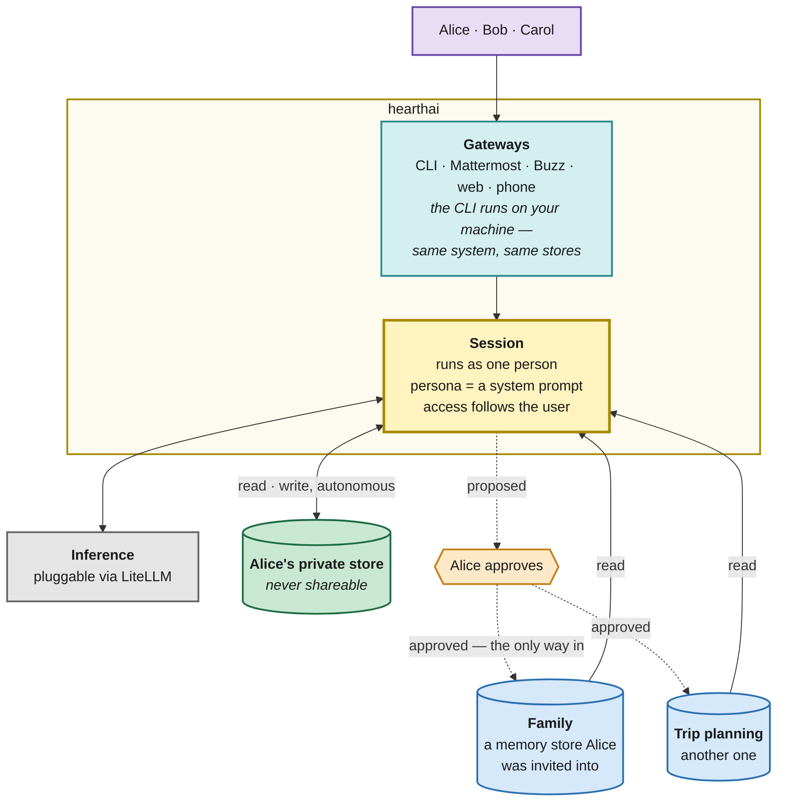

# hearthai

An AI that serves a group of people rather than one person. Everyone who uses it has a private
memory that nobody else can reach — not other members, not whoever runs the server — and shares
what they choose to by putting it in a memory store they invite others into.

**Memory is what makes it worth more than a chatbot.** A model without context can answer
questions; it cannot notice that the dentist appointment collides with a soccer match, that this
is the third time this quarter the same bill has come up, or that a decision made in March is the
reason for the constraint being hit in November. The accumulated context is the product.
Everything else exists to gather it, keep it good, and keep it where it belongs.

**It should be available and personable.** Available means reachable through whatever medium you
already use, rather than one more app to open. Personable means it is recognisably the same
someone each time — not five stateless bots wearing the same name in five different channels.

**Status: pre-design.** Nothing is built. [`docs/SPEC.md`](docs/SPEC.md) holds the longer
behavioral spec this is drawn from; where the two disagree, this README is current. No technology
choice here is committed. Licensed AGPL-3.0.

## How it works

Alice's view. Bob and Carol each have the same shape: their own private store, plus whichever
memory stores they have been invited into. Reads are wide — everything Alice holds. Writes are
narrow: straight into her private store, and into a shared memory store only when she says yes.

## Reachable where you already are

hearthai does not really have a user interface. It has **gateways** — one per medium, and each
one part of hearthai itself rather than a client pointed at it. A CLI, Mattermost,
[Buzz](https://buzz.xyz), web chat, a phone. Adding a medium means writing a gateway, not
building another product. Each authenticates the person (any OIDC provider) and hands the session
a verified identity; behind all of them is the same entity.

**The CLI is the clearest case of a gateway being part of the system.** It is not a thin client
talking to a server: it is hearthai running on your machine, granted access to the same central
memory stores as every other gateway. That is why it can reach local tools, local files, and the
local network — it is already local. Nothing is lent inward to a remote brain; the system extends
outward to where you are and reaches back to the stores. What it can touch locally lasts as long
as that session, and ends with it.

Other gateways carry no local capability, and mostly do not need any — a conversation in
Mattermost is a conversation. What varies between gateways is what the surface can do, never who
you are or what you can reach: those follow your identity, identically everywhere.

**Being personable is the whole reason for one entity behind many gateways.** What you worked
through at the CLI on Tuesday is known to the Mattermost thread on Thursday, because memory
belongs to the person, not the gateway. Personas give it a consistent voice; the memory stores
give it a continuous history. A separate bot per medium would be several passable acquaintances
instead of one that actually knows you.

## Users and memory stores

| Concept | Rule |
|---|---|
| **User** | Authenticates through any OIDC provider. Identity is a verified claim, never something asserted in chat. |
| **Private memory store** | Exactly one per user, created with the account. **Never shareable** — there is no invite, no admin override, no operator read. |
| **Shared memory store** | Created by a user, who invites others. Membership is the access rule; there is nothing else to configure. |
| **Access** | A session reads the user's private store plus every memory store they are a member of. Nothing else exists to it. |
| **Writes** | Autonomous into the user's own private store. Human-approved into any shared memory store. |

Three things follow that are worth being explicit about.

**A household is not a concept in the system.** It is a memory store someone created and invited
their family into. So are a couple's shared finances, a project with a colleague, and a trip with
friends. One mechanism covers all of them, and none of them needed to be designed for.

**Non-shareable means non-shareable.** The private store's unshareability is a property of the
store, not a permission that could be granted later. Running the server does not grant it. This
is the one thing in the system that has no override, which is what makes the rest safe to use
casually.

**Approval is what makes sharing deliberate.** Anything landing where other people can read it
passes a human first. The agent proposes; a person says yes. In practice this is conversational
— *"want me to put that in the family store?"* — not an administrative queue.

## Personas

A persona is **a system prompt**. It gives the conversation a direction — a home manager, a
medical advisor, a financial advisor — and that is the whole of it.

Access always follows the user, never the persona. A persona reads exactly what its user holds,
so switching personas cannot reach anything new, and restricting one would only make its answers
worse: a medical advisor that cannot see financial context cannot notice that a financial
pressure is driving a health decision. **Personas direct attention; the memory store membership
boundary is what actually gates.**

Adding a persona is therefore writing a prompt, not building a subsystem. So is adding a person,
or a new shared memory store. That is where most of hearthai's behavior is meant to live.

Writes carry the persona that produced them as a tag. That is **provenance, not permission** —
it supports attribution, promotion candidates, and per-persona review of git history, and it is
never consulted for access.

## What runs on a schedule

Not everything happens in a conversation. Periodic jobs read the accumulated corpus and produce
**proposals** — never actions.

| Analysis | Looks for | Proposes |
|---|---|---|
| **Sharing** | knowledge in your private store that belongs in a memory store you are in | *"should this go in the family store?"* |
| **Routines** | things you repeat — same request, same shape, same cadence | *"want me to do this every Monday?"* |
| **Skills** | procedures you have worked through more than once | *"want me to save how this is done — and is it shareable?"* |

One shape, three analyses: read the corpus, notice something, ask. They run on a schedule rather
than live because the patterns worth noticing are only visible across weeks of accumulation, not
in the current turn — and keeping them off the request path lets the analysis be slow, thorough,
and auditable on its own.

### Skills are Agent Skills

Not a memory type — the open [Agent Skills](https://agentskills.io) format, originally from
Anthropic. A skill is a folder holding a `SKILL.md` (`name` and `description` in frontmatter,
instructions in the body) and optionally `scripts/`, `references/`, and `assets/`. Agents load
them by progressive disclosure: names and descriptions at startup, the full instructions only
once a task matches one, bundled code only when it runs. Many skills therefore cost almost no
context until they are needed.

Skills live in memory stores and are versioned in git alongside everything else there, but they
are not memory. Memory is what the system knows; a skill is a procedure it can follow.

**Adopting the format rather than inventing one is the whole point.** A skill hearthai learns
works unchanged in Claude Code, OpenClaw, Hermes, Letta, ZeroClaw, Goose and everything else that
supports it — four of which are already in this README's prior art, and one of which is the kind
of host the memory layer gets built inside first. Learned skills are usable there from day one
instead of trapped in hearthai.

Skills arrive two ways: written by the scheduled analysis, or installed deliberately by a user
from the wider ecosystem. Installing is a human act, so third-party code never enters because the
system reached for it on its own.

**Sharing works differently for skills than for memory.** hearthai asks once, when the skill is
created, whether it is shareable; that answer decides where it lives. A skill in a shared memory
store is then available to every member automatically, with no further approval per person or per
use. One marked private stays in its creator's private store. This is not an exception to
invariant 4 — a human still approves before anything reaches a shared store — it is the same
approval granted once at creation rather than per write.

⚠ One gap that opens: **a skill gets revised, and a memory fact does not.** If the scheduled
analysis refines a skill already sitting in a shared store, the revision reaches every member
automatically, including changes to bundled scripts their agents execute. Creation-time
shareability does not cover later revisions. Unresolved.

**Proposals wait in a queue until you answer them, and by default they wait quietly** — you meet
them next time you talk, and nothing interrupts you in the meantime. A user who wants to be
reached can configure a gateway for it, and hearthai will raise proposals through that one. This
is **per user and off until someone turns it on**: being available is not the same as being
noisy, and one person opting in says nothing about anyone else. An unanswered proposal expires;
nothing acts by default. A learned routine needs
more than a yes, since "other people can read this" and "the system now acts without being asked"
are different sizes of decision: approving one means approving what it may do, not just that it
may run.

This also settles a question the design otherwise leaves open — *what licenses the system to
speak first?* **A pending proposal does, and nothing else does.**

**Intent inference lives as prompts and hooks, not as machinery.** Scoring an incoming signal for
urgency, novelty and risk to decide whether to act, ask, watch, or ignore — OpenAGI's directional
adaptive scrutiny — and PAI's hook-driven context assembly are behavior: system prompts and hook
points, changed by editing text rather than by shipping a component.

## Components

Six replaceable parts, each with a contract, so any one can be swapped. The first three are the
product; the last three are internal features that keep it honest.

| Component | Responsibility | Candidate (provisional) |
|---|---|---|
| **Gateway** | Part of hearthai, one per medium — CLI, chat platform, web, phone. Authenticates the person, hands the session a verified identity and the memory stores it holds, and carries whatever local capability that medium has for as long as the session lasts. Also the route for proactive contact, where a user has enabled it. | OIDC against any provider |
| **Memory connector** | Read and write access to memory stores. Fail-closed on membership: a store you are not in is unreachable, not filtered. Every write is a git commit. | OKF bundles (markdown + YAML frontmatter), git, QMD retrieval |
| **Memory manager** | Keeps memory good over years. Runs mostly as scheduled analysis rather than in the request path: dedup, contradictions, staleness, and the three proposal jobs above. Owns persona tagging and the proposal queue. | Condenser over the bundles; cron on the cluster |
| **Inference engine** | Model access behind one interface, so which model answers is a routing decision. | LiteLLM; cloud primary, local when available |
| **Tool execution isolation** | Where tool calls run and what they may touch. Guarantees: sandboxed filesystem and network, secrets never in an agent's context or environment, results projected before they reach a model. | Containers + NetworkPolicy; MCP as the tool standard |
| **Agent isolation** | Which subagents may be spawned, and tracking whether data came from a person or from the web. Untrusted content cannot reach a write or an external action without a human. | Compiled policy; CaMeL-style planner/quarantine split |

The last two are the reason it is safe to let this thing read the web and touch real services.
They are deliberately absent from the diagram: they shape what happens inside a request, not what
hearthai *is*.

## Invariants

1. **A private memory store is never shareable.** No invitation, no admin, no operator.
2. **Identity is a verified claim, never text.** Nothing said in chat can change who you are.
3. **Memory store access fails closed.** Unreachable, not filtered.
4. **Writes into a shared memory store are always human-approved.** The agent proposes; a person
   decides.
5. **A persona never changes access.** It directs attention within what the user already holds.
6. **Secrets never enter an agent's context or environment.** Redaction at the display layer is
   not isolation.
7. **Scheduled analysis proposes; it never acts.** No background job writes to a shared
   memory store, runs a routine, or contacts anyone without a person answering first.
8. **Enforcement is runtime, not prompt-level pleading.**

## Status and build order

MVP: OIDC login, one private memory store per user, user-created shared memory stores with invitations,
OKF bundles under git with QMD retrieval, autonomous private writes with approved shared writes,
persona prompts, pluggable inference, and the scheduled sharing analysis with its proposal
queue. Routine and skill *learning* follow once there is a corpus worth mining; using and installing
Agent Skills is not gated on that. Deferred: consolidation and compaction behavior,
sensitivity-based inference routing, vector or graph retrieval, and any allowlist for external
writes — those stay human-approved.

**The memory layer gets built first**, standalone, as a plugin for an agent that already exists.
It has the longest feedback loop — whether dedup and staleness handling actually work takes months
of real writes to learn, not a week of synthetic testing — and it is the differentiated part,
since orchestrators are commodity and human-legible multi-user memory is not. Exposing it as a
serializable interface to a foreign host also proves the component contract instead of asserting
it. Identity, memory store, and write-provenance are parameters on that interface from the first
commit, even while the interim host can only supply one of each.

One thing is unresolved: **memory quality is now owned but unproven.** The scheduled jobs are the
answer to entropy on paper; whether dedup, contradiction resolution, and staleness handling
actually work is the thing months of real writes will decide.

## Prior art

Detail and links in [`docs/SPEC.md`](docs/SPEC.md#12-references).

- **[IronCurtain](https://github.com/provos/ironcurtain)** — constitution-compiled policy;
  credentials that never enter the container.
- **[Hermes Agent](https://github.com/NousResearch/hermes-agent)** — one agent and one memory
  across many surfaces.
- **[CaMeL](https://arxiv.org/abs/2503.18813)** — privileged planner, quarantined processor,
  deterministic enforcement at tool-call boundaries.
- **[OKF](https://github.com/GoogleCloudPlatform/knowledge-catalog/tree/main/okf)** — markdown +
  YAML frontmatter bundles, git-native and readable with `cat`.
- **QMD** — local-first hybrid retrieval over markdown.
- **Letta / MemGPT** — explicit, editable memory blocks; the inspectability argument. Also
  supports Agent Skills.
- **Zep (Graphiti), Mem0** — the upgrade path if file-based retrieval hits its ceiling.
- **[Agent Skills](https://agentskills.io)** — open format for packaging procedural knowledge as
  a `SKILL.md` folder; progressive disclosure; portable across skills-compatible agents.
- **ZeroClaw** — encrypted secrets and scoped filesystem access by default; supports Agent Skills.
- **Honcho** — dialectic user modeling; a candidate for the memory-quality problem.
- **OpenAGI** — directional adaptive scrutiny (act / ask / watch / ignore / delegate) and a
  promote-demote condenser over tiered memory.
- **PAI** (Daniel Miessler) — hook-driven context assembly, and intent inference as prompts
  rather than infrastructure.

None of them provide the load-bearing requirement: per-user private memory with user-created
sharing on top.
