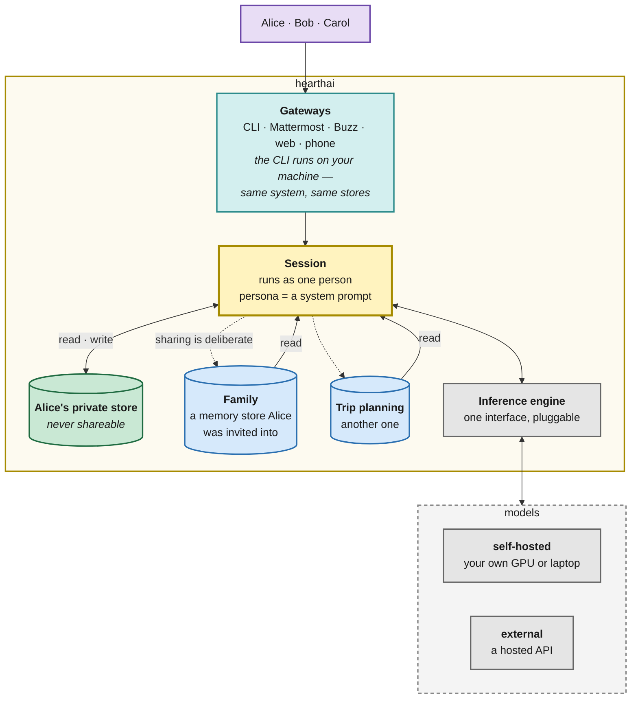

# hearthai

An AI that serves a group of people rather than one person, reachable wherever they already are.

Everyone who uses it has a private memory nobody else can reach — not other members, not whoever
runs the server — and shares what they choose to by putting it in a memory store they invite
others into.

**Memory is what makes it worth more than a chatbot.** A model without context can answer
questions; it cannot notice that the dentist appointment collides with a soccer match, or that a
decision made in March is the reason for the constraint being hit in November. The accumulated
context is the product, and the rest of the system exists to gather it, keep it good, and keep it
where it belongs.

**It should be available and personable.** Available means reachable through whatever medium you
already use rather than one more app to open. Personable means it is recognisably the same
someone each time, not five stateless bots wearing one name in five channels.

**Status: nothing is built, and most of this is a guess.** This README is a direction, not a
specification. The shape below is what seems right today; almost all of it will change on contact
with a working system, and the [open questions](#what-is-unknown) are as much a part of the
design as the diagram. [`docs/SPEC.md`](docs/SPEC.md) holds a longer, older behavioral spec with
more speculation in it; where they disagree, this file is current. Licensed AGPL-3.0.

## The shape

Alice's view; everyone has the same shape. Everything in the boundary is hearthai — the gateways
included, since a gateway is part of the system rather than a client pointed at it. The models are
the one part that lives elsewhere: your own hardware, a hosted API, or both.

## The pieces

Six parts, loosely. Each should be replaceable, which mostly means not letting them grow into each
other. None of the contracts are settled.

| | |
|---|---|
| **Gateways** | One per medium — CLI, chat platform, web, phone. Authenticates the person and carries whatever that medium can do. |
| **Memory connector** | Reading and writing memory stores, with access decided by identity. Files under git is the current guess, probably [OKF](https://github.com/GoogleCloudPlatform/knowledge-catalog/tree/main/okf) bundles with something like QMD over them. |
| **Memory manager** | Keeping memory good over years — what to keep, what is stale, what contradicts what. The least understood piece by a distance. |
| **Inference engine** | Model access behind one interface, so which model answers is a routing decision. LiteLLM probably. |
| **Tool isolation** | Where tool calls run and what they can touch. |
| **Agent isolation** | What may be spawned, and keeping track of what came from a person versus off the web. |

The last two are why it could be safe to let this read the web and touch real services. They are
deliberately out of the diagram — they shape what happens inside a request, not what hearthai is.

## How it is meant to feel

**Personas are prompts.** A home manager, a medical advisor, a financial advisor — a persona
points a conversation somewhere. It does not change what you can reach; access follows you, not
the persona. Adding one is writing a prompt.

**The CLI is hearthai on your machine**, not a thin client talking to a server. It reaches the
same central stores as every other gateway, which is also why it can touch local files and tools:
it is already local.

**It should get better in the background.** Noticing that something private is worth sharing,
that a task repeats often enough to automate, that a procedure is worth keeping as a reusable
[Agent Skill](https://agentskills.io) — this seems like periodic analysis over accumulated
memory rather than anything that happens mid-conversation. How that actually works is unknown.

**It should not be noisy.** Being available is not the same as interrupting. Anything the system
wants to raise should be able to wait until you next talk to it, and reaching out should be
something a person turns on for themselves rather than a default.

## What we are not willing to trade away

Everything else in this document is negotiable. These are not:

1. **A private memory store is private.** Not shareable by invitation, by an administrator, or by
   whoever runs the server. If this turns out to be inconvenient, the inconvenience wins.
2. **Sharing is deliberate.** Nothing lands where other people can read it because the system
   decided it should.
3. **Access follows the person, not the prompt.** Whatever a persona is doing, it reaches what its
   user reaches.

Even these are stated as intentions rather than proven guarantees — there is no code to enforce
them yet.

## What is unknown

The honest list. These are not edge cases; several go to whether the idea works at all.

- **Whether memory quality is tractable.** Accumulating memory is easy. Keeping it accurate,
  deduplicated, and current over years is the whole bet, and nothing here shows it can be done.
  Months of real use will say more than any amount of design.
- **What "sharing is deliberate" costs in practice.** Approving every crossing may be
  unbearable, or fine, or something that wants batching. Unknown until someone lives with it.
- **How much structure memory needs.** Files under git are legible and cheap; whether retrieval
  over them holds up, and when a real index becomes necessary, is untested.
- **What proactivity should be licensed by.** A system that only ever responds is a worse
  assistant. One that decides on its own when to speak is worse still. Where the line sits is
  unresolved.
- **How isolation actually gets enforced**, and how much utility it costs, once web content and
  real credentials are in play.
- **Whether learned procedures are safe to share** once they carry executable code, and what
  happens as they get revised.
- **How families with children work.** Private-means-private and guardianship pull in opposite
  directions, and nothing here reconciles them.
- **Whether any of this needs to be built.** Several existing projects overlap heavily. The
  household-shaped multi-user memory is the part that seems missing; that judgement is worth
  rechecking before writing much code.

## Where it starts — what is in this repo

The shape above is where this is going. What exists now is the smallest useful piece of it:
**shared memory, as a skill plus a service.**

The bet is that the household layer does not need its own agent. Run an existing one per person —
[Hermes](https://github.com/NousResearch/hermes-agent) supports a profile per person, each with
isolated memory, sessions, skills, and credentials — and everyone's private memory is private by
construction, because it lives in a separate process on a separate home directory. What is missing
between those agents is a way to share, and that is a skill.

| | |
|---|---|
| [`skills/shared-memory/`](skills/shared-memory/) | An [Agent Skill](https://agentskills.io): when to share, when to look, and a CLI that talks to the service. Works in any skills-compatible agent, so this is not a bet on one runtime. |
| [`service/`](service/) | Stores that several agents read and write. Markdown with frontmatter, committed to git on every write. Python, standard library only. |
| [`deploy/kubernetes/`](deploy/kubernetes/) | The service as a cluster workload — one replica, a persistent volume, non-root and read-only rootfs. Agents run per person and reach it over the network, so it has to live somewhere they can all get to. |

A store is addressed by a secret token generated at creation. The service keeps only
`sha256(token)` and finds a store by hashing what the caller presents, so the token never lands on
disk. That is the whole of access control for now: **a bearer capability, unrevocable, with
self-asserted attribution.** Fine among people who already trust each other. Not authentication,
and documented as such in [`service/README.md`](service/README.md). The token travels in a
header rather than a URL, since paths end up in proxy logs and a logged token is a permanent one.

This deliberately starts with the memory layer rather than an orchestrator. It has the longest
feedback loop of anything here, so its clock should start first; it is the part that seems
genuinely missing from the ecosystem, where orchestrators are not; and building it against a
foreign host keeps it honest about being separable rather than fused to a system that does not
exist yet.

What it does not yet do: shared memory is not ambient. A skill is consulted when its description
matches the conversation, so an agent only knows what it thought to look up. Making shared context
arrive without being asked for — a session-start hook, or a sync into local memory — is the next
question, and the sync option trades away retraction.

## Prior art

Worth stealing from; several overlap enough to be worth using directly.

- **[IronCurtain](https://github.com/provos/ironcurtain)** — policy-driven runtime; credentials
  that never enter the container.
- **[Hermes Agent](https://github.com/NousResearch/hermes-agent)** — one agent and one memory
  across many surfaces.
- **[CaMeL](https://arxiv.org/abs/2503.18813)** — a principled approach to prompt injection:
  planner, quarantined processor, enforcement at tool boundaries.
- **[Agent Skills](https://agentskills.io)** — open format for packaging procedural knowledge,
  portable across most agent runtimes.
- **[OKF](https://github.com/GoogleCloudPlatform/knowledge-catalog/tree/main/okf)** — markdown and
  YAML frontmatter bundles, git-native and readable with `cat`.
- **Letta / MemGPT** — explicit, editable memory blocks; the inspectability argument.
- **Zep (Graphiti), Mem0** — where to go if files stop being enough.
- **OpenClaw, ZeroClaw, Goose** — self-hosted assistants with overlapping ambitions.
- **OpenAGI** — scoring a signal to decide act / ask / watch / ignore.
- **PAI** (Daniel Miessler) — hook-driven context assembly.
