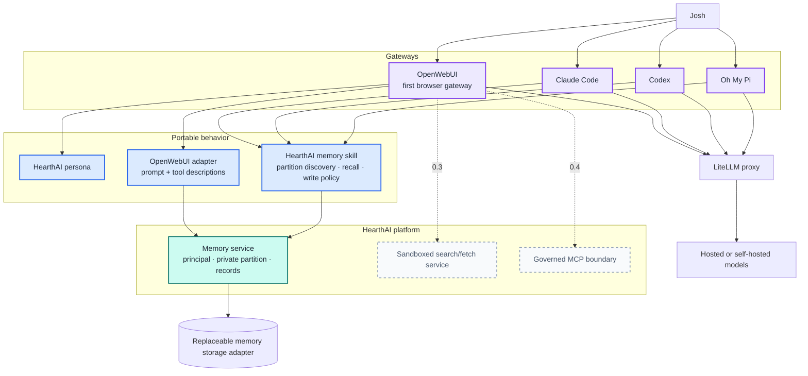
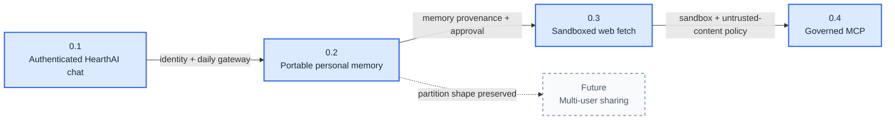
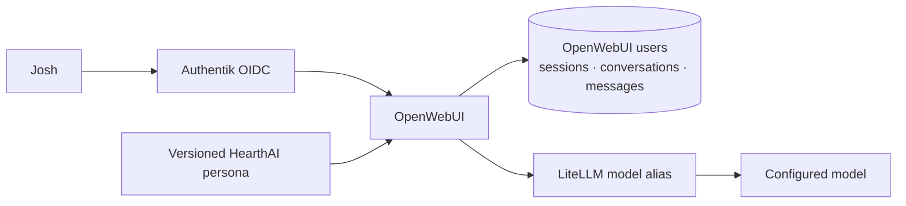
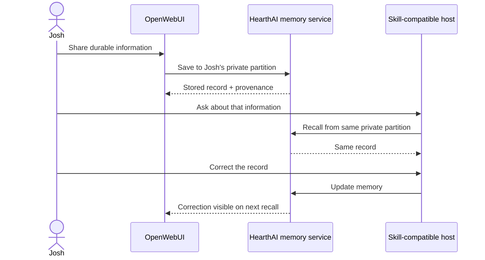
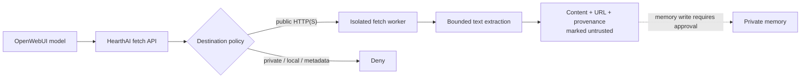
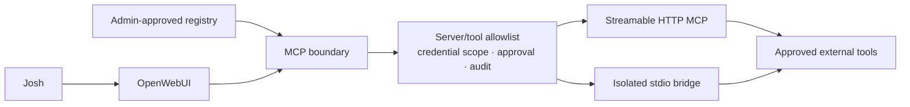

# HearthAI Architecture

**Status:** working architecture and approved single-user capability roadmap  
**Roadmap design:** [`superpowers/specs/2026-08-30-capability-roadmap-design.md`](superpowers/specs/2026-08-30-capability-roadmap-design.md)  
**Memory design detail:** [`superpowers/specs/2026-08-27-portable-cross-host-memory-design.md`](superpowers/specs/2026-08-27-portable-cross-host-memory-design.md)

HearthAI starts as a browser product Josh can use every day, then layers in portable personal memory, safe access to external information, and governed tool interoperability. Multi-user sharing remains a long-term architectural direction without a release number.

## Product model

```text
Gateway       where the conversation happens
Skill         portable partitioned-memory behavior
Platform      durable state and governed capabilities
Inference     model access and routing
```

No one implementation owns HearthAI:

- OpenWebUI is the first gateway, not the permanent UI contract.
- The Agent Skill carries partitioned-memory behavior across compatible hosts.
- HearthAI platform services own durable memory and later security boundaries.
- LiteLLM isolates HearthAI from model-provider APIs.

## System architecture



## Component boundaries

| Component | Owns | Does not own |
|---|---|---|
| **OpenWebUI** | Browser chat, streaming UI, server-side conversation history, OIDC sessions | HearthAI long-term memory semantics |
| **HearthAI persona** | Stable assistant identity and baseline conversational behavior | Durable state or authorization |
| **HearthAI memory skill** | Partition discovery, recall behavior, private-write policy, service invocation, honest failure reporting | Web UI, inference routing, fetch, MCP governance |
| **OpenWebUI memory adapter** | Projecting the canonical memory behavior into OpenWebUI prompts and tool descriptions | Redefining partitions or access rules |
| **Memory service** | Principal mapping, private partitions, records, retrieval, correction, deletion, export | Host-specific prompting or conversation history |
| **Sandboxed fetch service** | Network policy, search/fetch, provenance, untrusted-content marking | General code execution or memory persistence |
| **MCP boundary** | Approved servers and tools, scoped credentials, audit, approvals | Bypassing sandbox or memory policy |
| **LiteLLM** | Model endpoint normalization and provider routing | HearthAI product state or memory |

## Current repository state

### Built

- shared-memory Agent Skill;
- network shared-memory service;
- Markdown/frontmatter records;
- Git-per-write versioning;
- term-overlap retrieval;
- idempotent duplicate handling;
- Docker image;
- single-replica hardened Helm deployment;
- service, image, persistence, chart, and shutdown tests.

### Not yet built as a released HearthAI capability

- OpenWebUI gateway deployment owned by this repository;
- Authentik OIDC integration;
- LiteLLM gateway configuration;
- versioned HearthAI persona;
- personal cross-host memory release;
- sandboxed external-information service;
- governed MCP release.

The working shared-memory slice remains useful implementation evidence. It does not force multi-user sharing into the near-term roadmap.

## Portable memory model

The skill provides the distinctive HearthAI concept of partitioned memory and a portable way to connect to the service.

### Single-user release

```text
principal: Josh
  └── private partition — exactly one, unshareable
```

The private partition is service-backed and accessible from OpenWebUI plus at least one Agent Skills-compatible host. Conversation history remains OpenWebUI gateway data; durable memory remains HearthAI platform data.

### Future multi-user shape

```text
principal
  ├── private partition — exactly one, never shareable
  └── shared stores — user-created, explicit membership
```

The 0.2 API may preserve this general shape internally, but no shared-store, invitation, membership, or cross-principal endpoint is exposed until a multi-user trust model exists.

## Skill contract

The memory skill owns:

1. discovering partitions available to the authenticated principal;
2. recalling relevant context from the service;
3. deciding what is durable enough to save;
4. writing and correcting private memory;
5. preserving provenance;
6. surfacing service errors instead of claiming success;
7. applying explicit approval to future non-private destinations.

Agent Skills-compatible hosts consume `SKILL.md`. OpenWebUI does not natively load Agent Skills, so its model configuration and OpenAPI tool descriptions must project the same behavior from the same canonical specification.

## Release roadmap



## 0.1 — Authenticated HearthAI chat

### Architecture



### Included

- Josh-only OIDC admission;
- one HearthAI persona;
- one LiteLLM model alias;
- streaming chat;
- server-side conversation history;
- reopen, rename, and delete conversations;
- logout and session expiry.

### Disabled

- OpenWebUI memory;
- HearthAI memory tools;
- web search and URL fetch;
- OpenAPI tools;
- MCP;
- code execution;
- arbitrary model selection;
- public signup and invitations.

### Acceptance

Josh can authenticate, stream a response from the configured HearthAI persona, close and reopen the browser, and recover the conversation. No memory or tool is visible or callable.

## 0.2 — Per-person LLM-managed memory

### Architecture



### Included

- stable principal mapping from Josh's OIDC identity;
- one unshareable private partition;
- HearthAI memory service;
- portable memory skill;
- OpenWebUI adapter;
- model-managed add, search, update, and delete;
- user-visible review and deletion;
- timestamps and source-host provenance;
- host-neutral export and backup;
- at least one non-OpenWebUI host using the same partition.

### Acceptance

A fact saved in OpenWebUI is recalled and corrected from another host, then the correction is visible back in OpenWebUI. No shared or second-principal API exists.

## 0.3 — Sandboxed web search and fetch

### Security boundary



### Included

- public HTTP(S) only;
- private, loopback, link-local, cluster, and metadata destinations blocked;
- redirect, timeout, type, and size limits;
- no ambient credentials;
- source provenance;
- fetched content marked untrusted;
- explicit approval before web-influenced memory writes;
- no shell, filesystem, or arbitrary socket access.

### Acceptance

HearthAI can cite a fetched public page, cannot reach internal addresses through direct URLs or redirects, and cannot silently persist page instructions.

## 0.4 — Governed MCP interoperability

### Architecture



### Included

- admin-only server registration;
- server and tool allowlists;
- assignment to Josh;
- credentials outside model context;
- per-user OAuth where supported;
- encrypted token persistence through durable OpenWebUI secrets;
- audit and revocation;
- approval gates for consequential operations;
- stdio only through isolation;
- tool output remains untrusted for memory purposes.

### Acceptance

Only approved servers and tools are visible and callable. Revocation applies on the next invocation. Consequential operations stop for approval. Tool output cannot silently modify memory.

## Deferred — Multi-user and shareable stores

No current release includes:

- invited users;
- public signup;
- shared-store creation;
- membership management;
- household roles;
- guardian relationships;
- cross-principal reads;
- shared-write approval UX.

A multi-user release requires a credible path for account lifecycle, invitations, membership, ownership, recovery, revocation, privacy, audit, and incident response. Until those exist, shareable stores remain an architectural direction rather than a promised version.

## Technology decision status

| Concern | Status |
|---|---|
| OpenWebUI as first browser gateway | Approved for 0.1 |
| Generic OIDC with Authentik | Approved for 0.1 |
| LiteLLM inference boundary | Approved for 0.1 |
| One HearthAI persona/model alias | Approved for 0.1 |
| HearthAI memory service + skill | Approved for 0.2 |
| OpenWebUI built-in memory as canonical store | Rejected; not portable |
| Files + Git memory adapter | Provisional implementation option |
| Neo4j or graph backend | Deferred until a measured graph-shaped query exists |
| Sandboxed fetch service | Approved boundary for 0.3 |
| OpenWebUI native MCP | Approved integration surface for 0.4, subject to governance |
| n8n | Deferred until a recurring asynchronous workflow exists |
| Multi-user sharing | Deferred without a release number |

## Release discipline

A release advances only after its deployed user-facing acceptance scenario passes. Compiling infrastructure is not a release boundary.

Each release updates:

- this architecture document;
- its threat model;
- deployment and rollback documentation;
- live acceptance evidence;
- the memory skill when partition behavior changes.

The roadmap optimizes for usable capability and architectural learning, not feature count.
