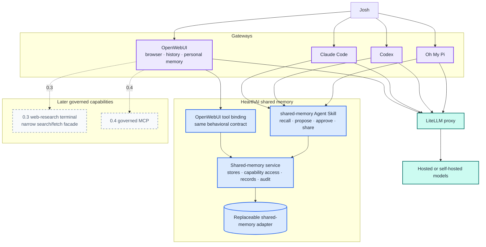
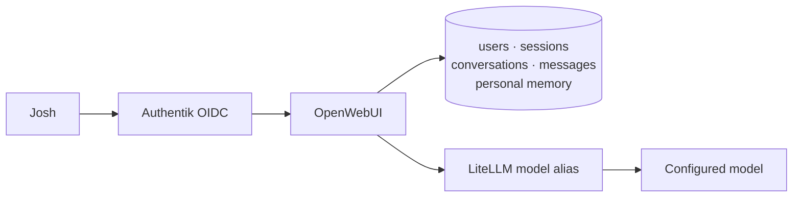
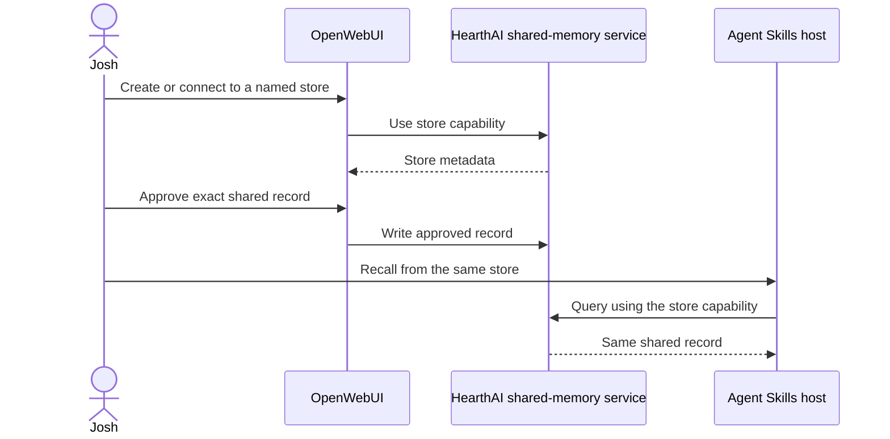
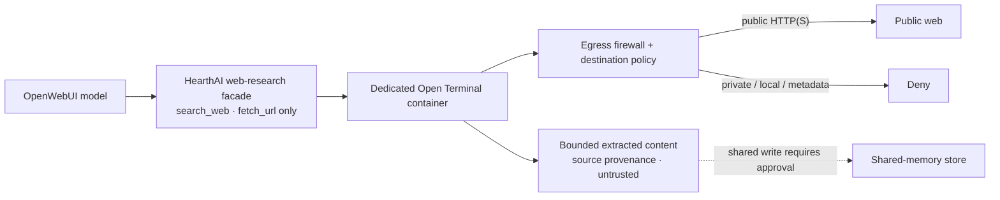
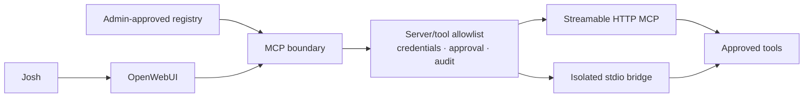

# HearthAI Architecture

**Status:** working architecture for the authoritative capability roadmap  
**Roadmap:** [`ROADMAP.md`](ROADMAP.md)  
**Design detail:** [`superpowers/specs/2026-08-30-capability-roadmap-design.md`](superpowers/specs/2026-08-30-capability-roadmap-design.md)

HearthAI begins as an OpenWebUI-based chat platform, adds a portable shared-memory skill and service, then layers in sandboxed external information and governed MCP interoperability.

Long-term personal-memory ownership is unresolved. OpenWebUI supplies personal memory in 0.1; HearthAI initially specializes in deliberately shareable memory.

## Product boundaries

```text
Gateway       OpenWebUI browser chat and gateway-local personal state
Skill         portable shared-memory behavior
Platform      shared-memory and governed capability services
Inference     LiteLLM model routing
```

## System architecture



## Component responsibilities

| Component | Owns | Does not own |
|---|---|---|
| **OpenWebUI** | Browser UI, streaming, conversations, OIDC sessions, near-term personal memory | HearthAI shared-memory semantics |
| **LiteLLM** | Model endpoint normalization and provider routing | HearthAI state or policy |
| **Shared-memory skill** | Store discovery, recall, record preparation, approval rules, service calls, honest failures | Browser UI, personal memory, fetch, MCP |
| **OpenWebUI shared-memory adapter** | Exposing the shared-memory contract as OpenWebUI tools and descriptions | Redefining stores or access |
| **Shared-memory service** | Store lifecycle, capability access, records, retrieval, audit, export | OpenWebUI account or personal-memory data |
| **Web-research terminal** | Isolated process/filesystem environment and egress enforcement | Model-facing general shell access |
| **Web-research facade** | Narrow search/fetch API, URL policy, provenance, taint | General terminal tools or shared-memory writes |
| **MCP boundary** | Approved servers/tools, scoped credentials, audit, approvals | Bypassing sandbox or memory approval |

## Memory architecture

### Personal memory

OpenWebUI built-in memory is the 0.1 personal-memory implementation. It provides model-managed add/search/update/delete behavior and user-facing review controls.

This is a near-term implementation choice, not a permanent ownership decision.

### HearthAI shareable memory

```text
shared-memory service
  ├── store: family
  ├── store: trip-planning
  └── store: project-x
```

A store is a named memory partition accessed by capability. It can be used by multiple hosts and, through out-of-band token transfer, by other people without a HearthAI-managed account system.

The initial sharing model is capability-based rather than identity-membership-based:

```text
store capability ─> access to one shared store
```

### Write policy

A model may recall from an available store. A shared write always requires a person to approve:

1. the exact durable content;
2. the exact destination store.

The model may propose; it may not silently share.

## Release architecture


## 0.1 — OpenWebUI foundation

### Architecture



### Included

- OpenWebUI;
- Authentik through generic OIDC;
- Josh-only access;
- LiteLLM;
- streaming chat;
- server-side conversations;
- OpenWebUI built-in memory and Personalization UI;
- durable database and secret configuration.

### Excluded

- prescribed HearthAI persona;
- HearthAI shared-memory tools;
- web access;
- MCP;
- code execution;
- public signup and additional users;
- custom frontend.

### Acceptance

Josh authenticates, chats through LiteLLM, recovers conversations after restart, and can add/review/correct/delete OpenWebUI personal memory. No external tool is callable.

## 0.2 — HearthAI shareable memory

### Architecture



### Included

- existing shared-memory service;
- portable shared-memory skill;
- OpenWebUI tool binding;
- named stores;
- capability-token access;
- out-of-band capability sharing;
- store-specific recall;
- approval before every shared write;
- audit and provenance;
- cross-host access;
- backup and human-readable export.

### Explicit boundary

0.2 does not replace OpenWebUI personal memory and does not add a HearthAI private partition. Whether personal memory eventually moves into HearthAI remains unresolved.

### Acceptance

OpenWebUI and one Agent Skills-compatible host use the same named store. A host without its capability has no access. Every write records exact approved content and destination. Tokens never enter URLs, prompts, stored memories, or logs.

## 0.3 — Isolated web-research terminal

### Layered boundary



Open Terminal is the preferred execution-substrate hypothesis, not the model-facing API. A custom facade exposes only search and fetch.

### Terminal isolation

- dedicated `web-research` container;
- custom minimal image or fixed startup packages;
- egress firewall;
- no host Docker socket;
- no private volumes;
- no host or browser credentials;
- no access to other terminals;
- Open Terminal API key held only by the facade.

### Model-facing surface

The model does not receive Open Terminal's general tools:

- no `run_command`;
- no file write;
- no package install;
- no process management;
- no Docker tools;
- no arbitrary sockets.

It receives only the narrow `search_web` and `fetch_url` contract, plus source provenance and explicit untrusted-content marking.

### Acceptance

HearthAI can cite a fetched public page, cannot reach internal addresses through direct URLs or redirects, and cannot silently persist page instructions. The model cannot access a general terminal surface.

## 0.4 — Governed MCP



MCP is introduced only after the web-research release establishes isolation, provenance, and approval rules. Tool output is untrusted and cannot silently write shared memory.

## Current repository state

### Built

- shared-memory Agent Skill;
- network shared-memory service;
- Markdown/frontmatter persistence;
- Git-per-write history;
- term-overlap retrieval;
- idempotent duplicate handling;
- Docker image and hardened single-replica Helm chart;
- service, image, chart, persistence, and shutdown tests.

### Not yet released through the roadmap

- OpenWebUI platform configuration;
- Authentik OIDC integration;
- LiteLLM configuration;
- OpenWebUI binding for the shared-memory service;
- isolated web-research terminal and narrow facade;
- governed MCP configuration.

## Deferred architecture

No numbered release promises:

- HearthAI-managed user accounts;
- invitations and verified membership;
- household roles or guardianship;
- account recovery and deprovisioning;
- operator-unreadable private memory;
- permanent personal-memory ownership;
- automatic discovery of other people.

These decisions follow evidence from 0.1 and 0.2.

## Technology decision status

| Concern | Status |
|---|---|
| OpenWebUI as initial platform | Approved for 0.1 |
| OpenWebUI built-in personal memory | Approved near-term; permanent ownership unresolved |
| Prescribed HearthAI persona | Excluded from 0.1 |
| Generic OIDC with Authentik | Approved for 0.1 |
| LiteLLM inference boundary | Approved for 0.1 |
| HearthAI shared-memory skill/service | Approved for 0.2 |
| Capability-token sharing | Approved starting model; scope/revocation still open |
| Open Terminal for web research | Preferred 0.3 substrate hypothesis |
| Narrow OpenAPI versus MCP facade | Open 0.3 decision |
| OpenWebUI native MCP | Approved integration surface for 0.4, subject to governance |
| Personal memory migration to HearthAI | Unresolved |
| Neo4j or graph backend | Deferred until a measured graph-shaped query exists |
| n8n | Deferred until a recurring asynchronous workflow exists |
| Rich multi-user identity | Deferred without a release number |

## Session recovery

Continue roadmap work from [`ROADMAP.md`](ROADMAP.md). Treat that file's 0.1–0.4 order and open decisions as authoritative. Older personal-memory implementation documents are archived context, not the current plan.
