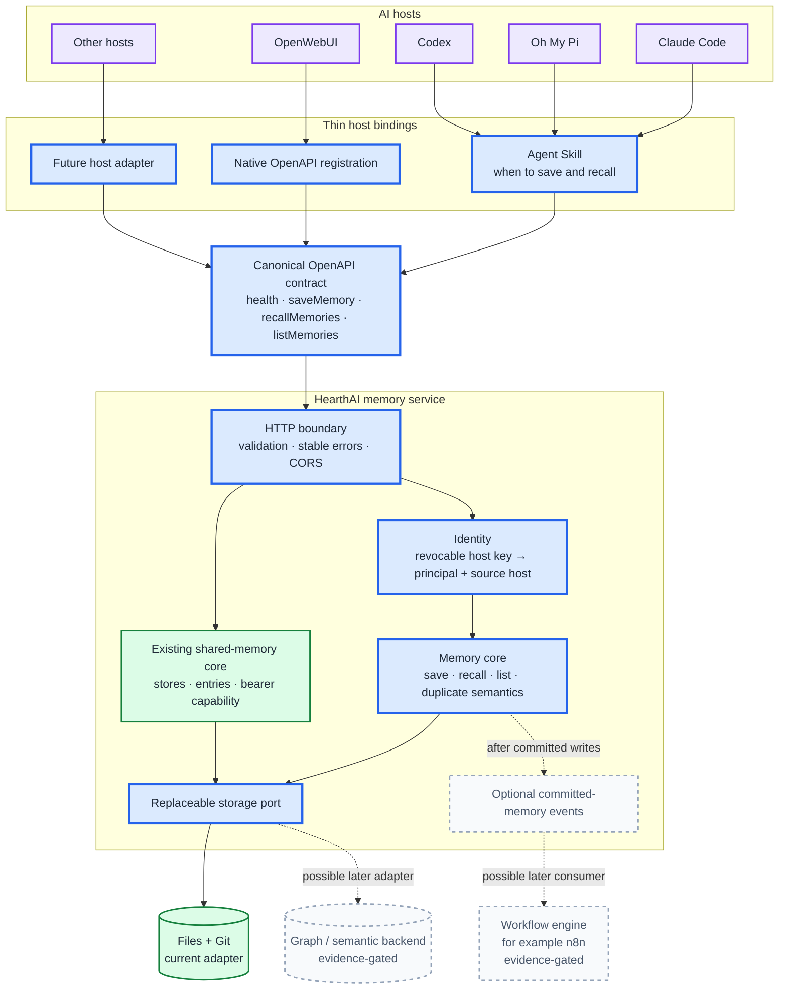
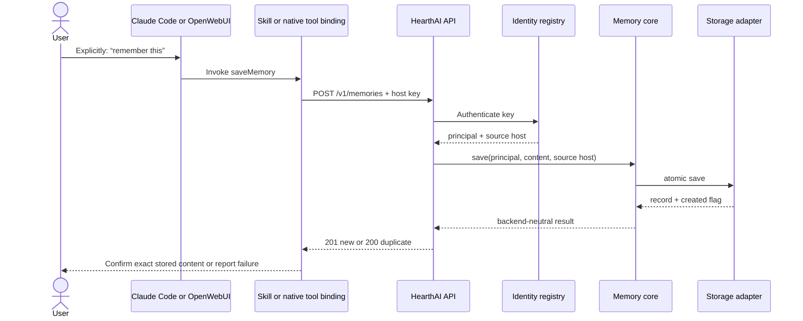
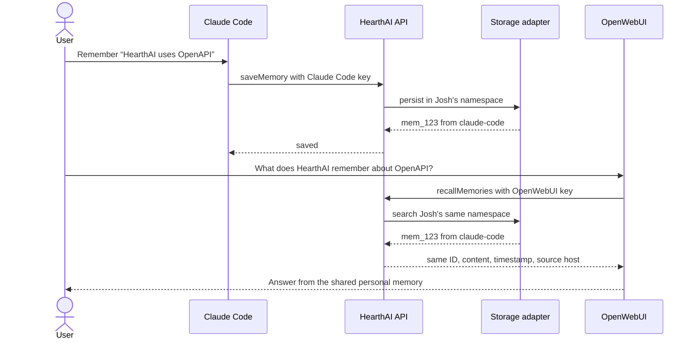
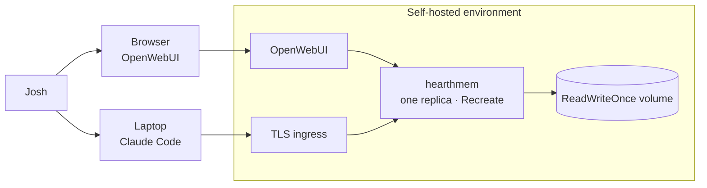
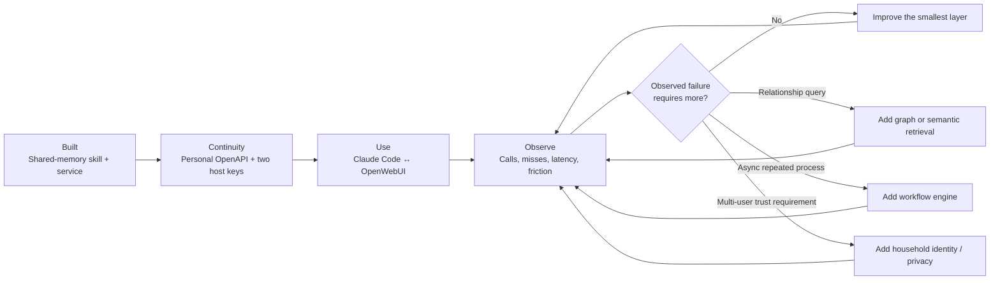

# HearthAI Architecture

**Status:** working architecture; current implementation and approved next increment  
**Detailed design:** [`superpowers/specs/2026-08-27-portable-cross-host-memory-design.md`](superpowers/specs/2026-08-27-portable-cross-host-memory-design.md)

HearthAI gives one person—or eventually a group of people—continuous memory across whichever AI hosts they use. The first proof is deliberately small: explicitly save a memory in one host, retrieve the same record in another, and learn from real use before selecting a sophisticated memory backend or workflow engine.

This document distinguishes three states:

- **Built:** present in the repository and usable now.
- **Approved next:** the next architectural increment.
- **Deferred:** a candidate that must be justified by observed use.

## Architectural thesis

The durable product boundary is not a database, agent runtime, or chat interface. It is a small memory contract with stable semantics:

```text
explicit save → authenticated principal → memory record → later recall from another host
```

Everything around that contract remains replaceable:

- AI host;
- host adapter;
- inference provider;
- storage backend;
- retrieval method;
- workflow engine;
- deployment location.

The first value proof is **cross-host continuity**, not advanced memory intelligence.

## Non-negotiable invariants

1. **Writes are explicit first.** A host saves only after an unambiguous user instruction.
2. **Identity is derived.** Principal, namespace, and source host come from credentials, never model-supplied claims.
3. **Host behavior is portable.** Hosts may integrate differently, but save and recall semantics do not change.
4. **Backends stay behind a port.** Files, Git, graph nodes, and workflow runs never appear in the host contract.
5. **Failure is visible.** A failed save is never reported as remembered; an empty recall is not disguised as a service failure.
6. **Complexity is earned.** Neo4j, n8n, semantic retrieval, and automatic extraction respond to demonstrated failures.
7. **Shared-memory behavior remains intact.** The existing skill and `/stores` API are a working product slice, not disposable scaffolding.

## Current state

### Built now

The repository currently contains:

- `skills/shared-memory/`: an Agent Skill for deliberate sharing and recall;
- `service/`: a standard-library Python service;
- bearer-capability shared stores addressed by secret tokens;
- Markdown/frontmatter records committed to Git on every write;
- idempotent duplicate handling;
- term-overlap retrieval;
- a Docker image and hardened single-replica Helm deployment;
- CI covering the service, image, chart, persistence, and graceful shutdown.

This proves that a portable skill can reach a network memory service and that human-readable Git-backed storage is sufficient to begin learning.

It does **not** yet prove:

- personal memory shared across hosts;
- revocable host identity;
- verified user identity;
- automatic or ambient recall;
- long-term memory quality;
- operator-unreadable private memory;
- graph-shaped retrieval;
- asynchronous memory workflows.

### Decision status

| Concern | Status | Meaning |
|---|---|---|
| OpenAPI as portable contract | **Approved next** | Host-visible memory semantics live in one schema. |
| Claude Code + OpenWebUI | **Approved next** | First two hosts for the continuity proof. |
| Explicit personal saves | **Approved next** | No automatic extraction in the first increment. |
| Revocable per-host keys | **Approved next** | Each host has a separate key mapped to one principal. |
| Files + Git | **Provisional** | Valid first adapter, not a permanent substrate decision. |
| OKF | **Provisional** | Useful human-readable format idea; not load-bearing. |
| Neo4j or another graph store | **Deferred** | Requires a recurring graph-shaped query and measured advantage. |
| n8n or another workflow engine | **Deferred** | Requires a repeated asynchronous workflow. |
| Semantic retrieval | **Deferred** | Requires captured paraphrase or relevance failures. |
| End-to-end encryption | **Deferred architecture project** | Required only when operator-unreadable storage becomes current. |
| OIDC and household membership | **Deferred** | Follows single-person cross-host validation. |

## System boundary



Green components are built. Blue components are the approved cross-host increment. Dashed grey components are deliberately deferred.

## Component responsibilities

| Component | Owns | Does not own |
|---|---|---|
| **Agent Skill** | Save/recall triggers, explicit-write policy, honest user-facing confirmation | Identity, storage layout, retrieval implementation |
| **Native host binding** | Registering or invoking OpenAPI operations in one host | Redefining records or access rules |
| **OpenAPI contract** | Operation IDs, request/response shapes, authentication, errors, tool descriptions | Files, Git, graph nodes, workflows |
| **HTTP boundary** | Parsing, validation, error envelopes, CORS, content-free telemetry | Memory policy or persistence |
| **Identity registry** | Key issuance, hashing, revocation, mapping host key to principal and source host | Prompt assertions or household policy |
| **Memory core** | Save, recall, list, duplicate semantics, backend-neutral records | Host prompting, Git commands, workflow scheduling |
| **Shared-memory core** | Existing user-created shared stores and entries | Personal identity semantics |
| **Storage port** | Stable persistence interface and adapter conformance | Host or API concepts |
| **Files + Git adapter** | Atomic human-readable persistence, audit history, simple term retrieval | Permanent architecture status |
| **Event boundary** | Optional events after a committed write | Synchronous memory correctness |
| **Workflow engine** | Later scheduling, retries, fan-out, external integrations, approvals | Being the memory database |

## Portable contract

The approved first contract exposes four operations:

| Operation ID | HTTP operation | Authentication | Purpose |
|---|---|---|---|
| `health` | `GET /health` | none | Status and service version only. |
| `saveMemory` | `POST /v1/memories` | host key | Save one explicitly approved memory. |
| `recallMemories` | `GET /v1/memories/recall?q=&limit=` | host key | Retrieve matching records using current adapter semantics. |
| `listMemories` | `GET /v1/memories?limit=` | host key | Return recent records without implying relevance. |

The portable distribution has two complementary artifacts:

- `openapi.json`: directly consumed by OpenWebUI and other OpenAPI-aware hosts;
- `SKILL.md`: consumed by Agent Skills-compatible hosts such as Claude Code.

The skill requires no HearthAI client library. It uses host-native capabilities to call the OpenAPI service. A host adapter is allowed to differ mechanically; it is not allowed to change consent, identity, record fields, or failure semantics.

## Memory record

The first personal-memory record is intentionally small:

```text
MemoryRecord
  id            opaque stable identifier
  content       non-empty user-approved text
  created_at    server-generated timestamp
  source_host   derived from the authenticating host key
```

Not present in the first record:

- arbitrary metadata;
- embeddings;
- graph edges;
- workflow state;
- model-supplied identity;
- correction or supersession links.

Those fields are added only after a concrete use case requires them.

## Identity and trust

### First increment

Each host receives its own secret key:

```text
Claude Code key ─┐
                  ├─> principal: Josh ─> one personal-memory namespace
OpenWebUI key ───┘
```

The service stores only key hashes. A key record contains a non-secret key ID, principal ID, host ID, creation time, and optional revocation time. Revoking one host does not revoke another.

Principal ID, namespace, and source host are derived from the key. Requests cannot assert them.

### Trust boundary

The first increment is self-hosted and operator-trusted. Personal memory is centrally readable by the operator. This is explicit; the architecture does not claim end-to-end encryption.

The longer-term principle that a server operator cannot read private memory requires a separate client-side encryption and key-management design. That project is deferred so it does not obscure the continuity proof.

### Existing shared memory

Shared stores retain their current capability-token model during the first personal-memory increment. They are a separate bounded context with separate observable behavior. A later household identity design may migrate them, but the personal-memory API does not silently reinterpret existing tokens as verified identity.

## Save flow



A duplicate returns the original record and does not change its timestamp or source host.

## Cross-host recall flow



That round trip is the first product acceptance test.

## Failure behavior

| Condition | Response | Host behavior |
|---|---|---|
| Empty or malformed request | `400 invalid_request` | Explain that nothing was saved. |
| Missing, unknown, malformed, or revoked key | `401 invalid_api_key` | Report authentication failure. |
| Cross-principal namespace request | `403 forbidden` | Report access denial. |
| Storage failure | `503 storage_unavailable` | Report that memory was not changed. |
| No matching memories | `200` with empty list | Say HearthAI has no matching stored memory. |

A storage exception never produces a plausible success record. Operational telemetry records operation, non-secret key ID, principal, host, status, latency, and result count—but not keys, queries, prompts, request content, or response content.

## Persistence strategy

### Files + Git now

Files and Git remain a valid starting adapter because they are:

- already implemented;
- inspectable;
- diffable;
- recoverable;
- inexpensive to operate;
- sufficient for the continuity proof.

They are not part of the OpenAPI contract. A host cannot tell whether a memory came from Markdown, a relational database, or a graph.

### Graph later

A graph backend is considered only when all of these exist:

1. a recurring real query requiring relationships or traversal;
2. evidence the current adapter cannot answer it correctly or maintainably;
3. a backend-neutral relationship model;
4. a migration and export path that leaves host contracts unchanged;
5. measured improvement on the captured query.

Neo4j is one possible implementation after this gate. It is not the architecture itself.

## Workflow strategy

n8n is an orchestration candidate, not a memory backend.

A workflow engine is considered only when real use reveals a repeated asynchronous process requiring one or more of:

- scheduling;
- retries;
- fan-out;
- external service integration;
- durable workflow state;
- human approval.

When justified, the workflow engine consumes backend-neutral events emitted **after** a memory commit. It never sits between a synchronous save request and durable persistence.

## Deployment topology



The Git-backed adapter keeps the existing single-writer constraints:

- exactly one service replica;
- `Recreate` deployment strategy;
- `ReadWriteOnce` storage;
- one in-process writer lock;
- non-root container;
- read-only root filesystem;
- `/data` as the durable writable volume;
- graceful SIGTERM drain before shutdown.

A future backend may relax some constraints, but only its adapter and deployment profile change—not host semantics.

## Incremental development path



### Increment 1 — Contract and identity

- Python 3.14 service baseline;
- canonical OpenAPI document;
- revocable host keys;
- one principal mapped from two host keys;
- backend-neutral personal-memory core;
- current files-and-Git adapter.

**Usable end state:** direct HTTP clients can save and recall personal memory with revocable credentials.

### Increment 2 — Two host bindings

- script-free Agent Skill for Claude Code;
- OpenAPI tool registration in OpenWebUI;
- secrets stored outside prompts and skill files.

**Usable end state:** both hosts explicitly save and recall through their normal interfaces.

### Increment 3 — Real use

- save through Claude Code, recall through OpenWebUI;
- save through OpenWebUI, recall through Claude Code;
- use explicit memory during normal work;
- review empty recalls, invocation misses, latency, duplicate frequency, and friction.

**Usable end state:** HearthAI is useful enough to generate its own architecture evidence.

### Increment 4 — Evidence-backed evolution

Improve only the layer real use proves inadequate. No graph database, workflow engine, identity provider, encryption system, or automatic extraction pipeline is an assumed milestone.

## What success teaches

If cross-host continuity is valuable with simple storage, HearthAI has validated its durable boundary without prematurely choosing a memory substrate. If it is not valuable, changing databases or adding orchestration would not fix the product thesis.

The architecture therefore optimizes first for **learning speed and replaceability**, then for memory sophistication.
