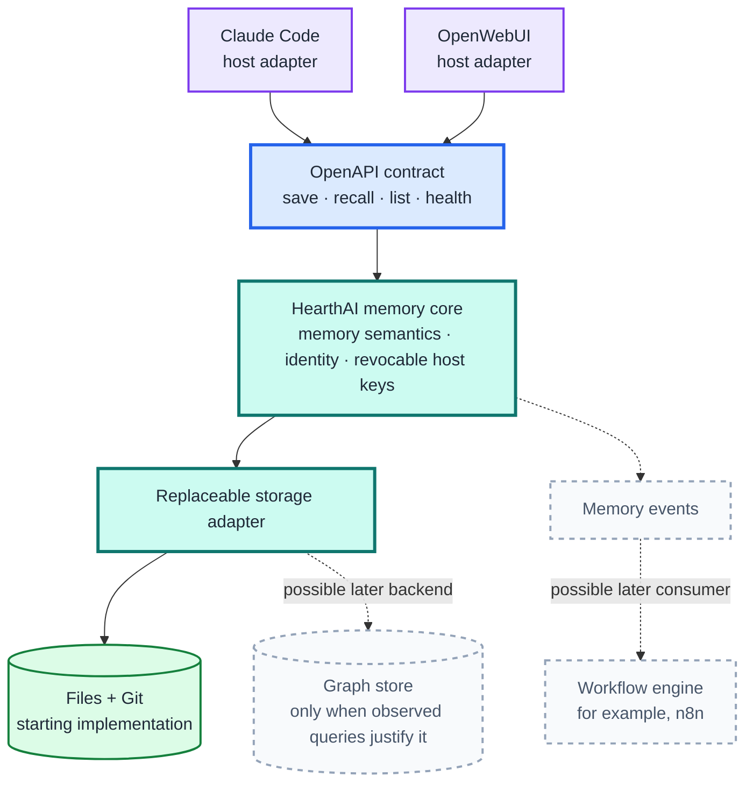
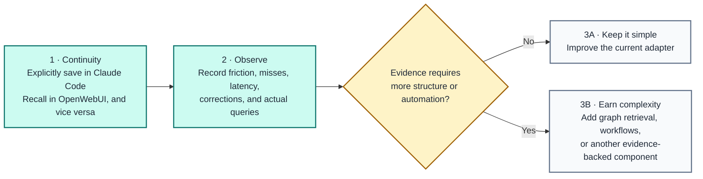

# Architecture Boundaries and Incremental Path

This is the working boundary for developing HearthAI incrementally. It deliberately does **not** choose a permanent memory backend or workflow engine.

## Portable memory boundary

The OpenAPI schema is the portable contract. Hosts may register or invoke its operations differently, but host-specific mechanics do not enter HearthAI's memory semantics. The contract also does not expose file paths, Git commits, graph nodes, or workflow-engine concepts.

The first implementation may continue using files and Git behind the storage adapter. That is a cheap way to begin gathering evidence, not a permanent architecture decision. A graph store is justified only by observed queries or update patterns that the simpler backend cannot serve. A workflow engine is a separate concern: it may react to memory events or schedule work, but it is not the memory substrate.

## Incremental runway

The first value proof is intentionally small:

1. One person uses Claude Code and OpenWebUI.
2. Memories enter HearthAI only through an explicit save instruction.
3. Each host has an independently revocable API key stored outside prompts.
4. A memory saved through either host is accessible through the other.

Cross-host continuity is sufficient to validate the first increment. Semantic retrieval, temporal reasoning, automatic extraction, household sharing, Neo4j, and n8n remain later hypotheses until usage produces evidence for them.
