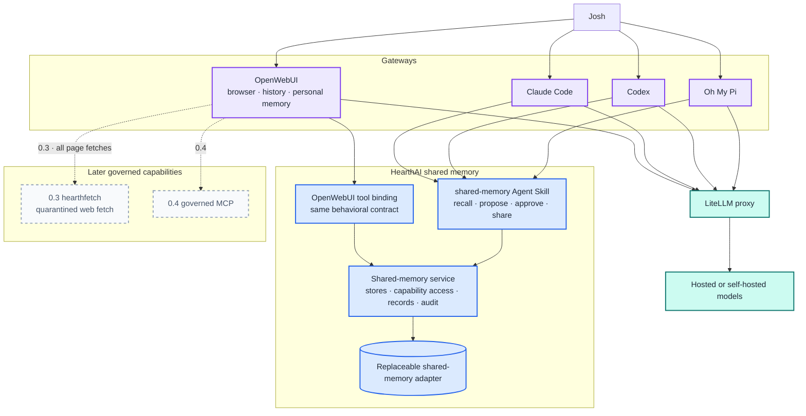
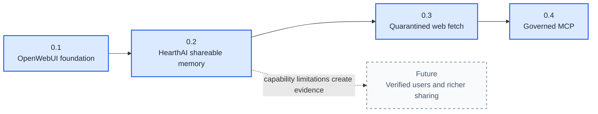
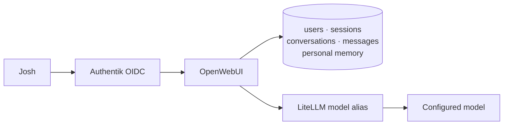
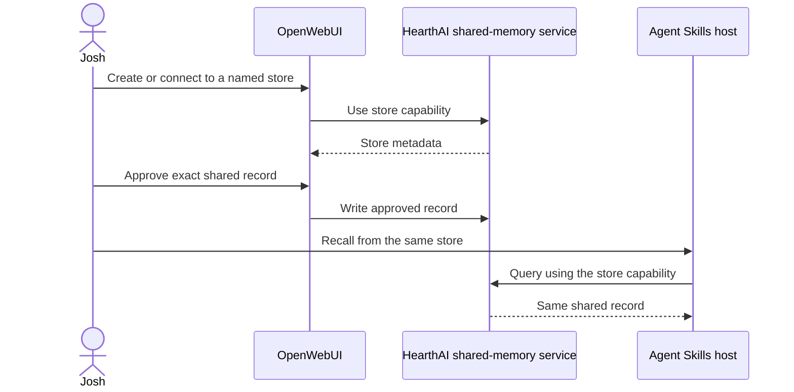
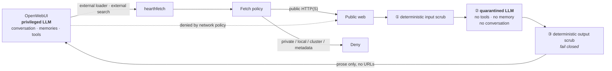
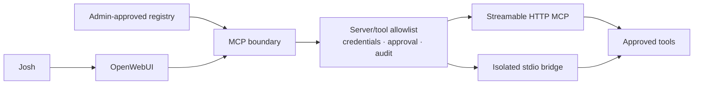

# HearthAI Architecture

**Status:** working architecture for the authoritative capability roadmap  
**Roadmap:** [`ROADMAP.md`](ROADMAP.md)  
**Design detail:** [`superpowers/specs/2026-08-30-capability-roadmap-design.md`](superpowers/specs/2026-08-30-capability-roadmap-design.md)

HearthAI begins as an OpenWebUI-based chat platform, adds a portable shared-memory skill and service, then takes ownership of web fetching so untrusted pages are read only by a quarantined model and reach the privileged context as scrubbed distillations, then adds governed MCP interoperability.

Long-term personal-memory ownership is unresolved. OpenWebUI supplies personal memory in 0.1; HearthAI initially specializes in deliberately shareable memory.

## Product boundaries

```text
Gateway       OpenWebUI browser chat and gateway-local personal state
Skill         portable shared-memory behavior
Platform      shared-memory and governed capability services
Inference     LiteLLM model routing
```

## System architecture



## Component responsibilities

| Component | Owns | Does not own |
|---|---|---|
| **OpenWebUI** | Browser UI, streaming, conversations, OIDC sessions, near-term personal memory | HearthAI shared-memory semantics |
| **LiteLLM** | Model endpoint normalization and provider routing | HearthAI state or policy |
| **Shared-memory skill** | Store discovery, recall, record preparation, approval rules, service calls, honest failures | Browser UI, personal memory, fetch, MCP |
| **OpenWebUI shared-memory adapter** | Exposing the shared-memory contract as OpenWebUI tools and descriptions | Redefining stores or access |
| **Shared-memory service** | Store lifecycle, capability access, records, retrieval, audit, export | OpenWebUI account or personal-memory data |
| **`hearthfetch`** | Fetch policy, deterministic input scrub, quarantined summarisation, deterministic output scrub, brokering the search provider, and aggregate metrics | Durable state, research synthesis, citations, caching, JavaScript execution, returning raw page text, or any general execution surface |
| **MCP boundary** | Approved servers/tools, scoped credentials, audit, approvals | Bypassing sandbox or memory approval |

## Deployment ownership

HearthAI owns `hearthfetch`'s behavior — fetch policy, the two deterministic scrubs, and the quarantined summarisation between them — plus its container image, Helm chart, and release automation. It does **not** own the wire contract: `hearthfetch` implements OpenWebUI's `external` loader and search contracts, pinned to the deployed version, so a change there is an upstream-compatibility question rather than a product decision.

The separate `home-ops` repository owns cluster deployment and integration wiring: OpenWebUI's `WEB_*` configuration, secret delivery, version pins, observability, and the network policies. The isolation claim rests on those policies — default-deny egress on `open-webui` — and `hearthfetch` must never be documented as though it enforces that itself.

`hearthfetch` is stateless and stays that way. No run records, no durable storage, no per-request Kubernetes object, no cache. Neither deployment configuration nor OpenWebUI may give it a lifecycle to manage.

## Memory architecture

### Personal memory

OpenWebUI built-in memory is the 0.1 personal-memory implementation. It provides model-managed add/search/update/delete behavior and user-facing review controls.

This is a near-term implementation choice, not a permanent ownership decision.

### HearthAI shareable memory

```text
shared-memory service
  ├── store: family
  ├── store: trip-planning
  └── store: project-x
```

A store is a named memory partition accessed by capability. It can be used by multiple hosts and, through out-of-band token transfer, by other people without a HearthAI-managed account system.

The initial sharing model is capability-based rather than identity-membership-based:

```text
store capability ─> access to one shared store
```

### Write policy

A model may recall from an available store. A shared write always requires a person to approve:

1. the exact durable content;
2. the exact destination store.

The model may propose; it may not silently share.

## Release architecture



## 0.1 — OpenWebUI foundation

### Architecture



### Included

- OpenWebUI;
- Authentik through generic OIDC;
- Josh-only access;
- LiteLLM;
- streaming chat;
- server-side conversations;
- OpenWebUI built-in memory and Personalization UI;
- durable database and secret configuration.

### Excluded

- prescribed HearthAI persona;
- HearthAI shared-memory tools;
- web access;
- MCP;
- code execution;
- public signup and additional users;
- custom frontend.

### Acceptance

Josh authenticates, chats through LiteLLM, recovers conversations after restart, and can add/review/correct/delete OpenWebUI personal memory. No external tool is callable.

## 0.2 — HearthAI shareable memory

### Architecture



### Included

- existing shared-memory service;
- portable shared-memory skill;
- OpenWebUI tool binding;
- named stores;
- capability-token access;
- out-of-band capability sharing;
- store-specific recall;
- approval before every shared write;
- audit and provenance;
- cross-host access;
- backup and human-readable export.

### Explicit boundary

0.2 does not replace OpenWebUI personal memory and does not add a HearthAI private partition. Whether personal memory eventually moves into HearthAI remains unresolved.

### Acceptance

OpenWebUI and one Agent Skills-compatible host use the same named store. A host without its capability has no access. Every write records exact approved content and destination. Tokens never enter URLs, prompts, stored memories, or logs.

## 0.3 — Quarantined web fetch with `hearthfetch`

### Layered boundary



OpenWebUI's `external` loader and search engines point at `hearthfetch`, which fetches,
scrubs, distils, scrubs again, and returns. It is stateless: a request is answered or it
fails, with no record kept.

### Why the boundary holds

The quarantined model reads hostile text with **no private data and no way to act** — two
of the three legs of the lethal trifecta absent by construction. A page that hijacks it
has hijacked something that knows nothing and can do nothing.

That is not sufficient on its own. The attack does not need the quarantined model to know
anything, only to repeat something: a page asks for a markdown image with a placeholder;
the quarantined model complies harmlessly because it cannot fill it in; the summary
reaches the privileged model, which can; the renderer makes the request. The instruction
is laundered through the summary into a context that holds the data.

This is the gap between the plain dual-LLM pattern and CaMeL, whose data-flow tracking
stops untrusted values reaching a sink. Full CaMeL is unavailable — it requires the
privileged side to be a plan-then-interpret system, and OpenWebUI is not — so 0.3 takes
the cheap decisive part, because HearthAI owns the only channel:

> **The model authors prose; the service authors every URL.**

Nothing URL-shaped survives stage ③. Anything that does causes the document to be dropped
rather than repaired.

### Isolation

- no tools, memory, conversation history, or credentials in the quarantined model beyond
  its own budgeted LiteLLM key;
- stages ① and ③ are deterministic code, never a prompt and never a model checking a model;
- no durable state, volume, or cache;
- no Kubernetes API access or service-account token;
- no path to `hearthmem` or cluster services;
- no JavaScript execution or headless browser;
- no cookies, ambient credentials, or forwarded caller headers on outbound fetches;
- bounded response size, content type, redirect count, concurrency, and time;
- private, loopback, link-local, cluster, and cloud-metadata destinations blocked for IPv4
  and IPv6, validated at connect time so DNS rebinding does not slip through;
- **no fallback to raw page text on any failure path** — that would silently remove the
  entire boundary.

### Model-facing surface

There is none, directly. `hearthfetch` sits inside OpenWebUI's retrieval pipeline rather
than being exposed as a tool, so the only model influence on it is the search query and
the URLs OpenWebUI chooses to load. Neither endpoint accepts an image, command, namespace,
credential, mount, timeout, or model-selection field.

The loader hook carries no query, so distillation there is query-blind. That is the
accepted cost of covering every fetch including pasted URLs; a question-aware tool surface
alongside it is an open decision.

Returned documents carry a scrubbed distillation and, in metadata, the post-redirect URL
placed by the service. No findings, citations, or evidence structures — those were removed
goals when the research framing was withdrawn.

### What is not claimed

Not provable security. CaMeL reports 67% of AgentDojo tasks solved with a guarantee; this
design has no comparable guarantee and no benchmark. It closes the exfiltration channel
that exists in this stack and narrows the influence channel to attacker-controlled prose.
The privileged model acting on false information, and renderer sinks other than markdown,
remain open.

### Acceptance

OpenWebUI searches and loads pasted URLs entirely through `hearthfetch` while having no
general internet egress of its own. No raw page text reaches the privileged context on any
path. No URL authored by the quarantined model survives into returned content, proven by
adversarial corpus and property test. Every input-corpus payload is removed while
legitimate visible text survives. Fetches fail closed against private destinations
including under rebinding. Per-URL failures are omitted and logged rather than failing the
conversation. No page content, URL, query, or summary becomes a metric label, and
output-scrub drops are observable as a security signal.

## 0.4 — Governed MCP



MCP is introduced only after the 0.3 release establishes isolation, untrusted-content handling, and approval rules. Tool output is untrusted and cannot silently write shared memory.

## Current repository state

### Built

- shared-memory Agent Skill;
- network shared-memory service;
- Markdown/frontmatter persistence;
- Git-per-write history;
- term-overlap retrieval;
- idempotent duplicate handling;
- Docker image and hardened single-replica Helm chart;
- service, image, chart, persistence, and shutdown tests.

### Not yet released through the roadmap

- OpenWebUI platform configuration;
- Authentik OIDC integration;
- LiteLLM configuration;
- OpenWebUI binding for the shared-memory service;
- `hearthfetch` and its OpenWebUI integration;
- governed MCP configuration.

## Deferred architecture

No numbered release promises:

- HearthAI-managed user accounts;
- invitations and verified membership;
- household roles or guardianship;
- account recovery and deprovisioning;
- operator-unreadable private memory;
- permanent personal-memory ownership;
- automatic discovery of other people.

These decisions follow evidence from 0.1 and 0.2.

## Technology decision status

| Concern | Status |
|---|---|
| OpenWebUI as initial platform | Approved for 0.1 |
| OpenWebUI built-in personal memory | Approved near-term; permanent ownership unresolved |
| Prescribed HearthAI persona | Excluded from 0.1 |
| Generic OIDC with Authentik | Approved for 0.1 |
| LiteLLM inference boundary | Approved for 0.1 |
| HearthAI shared-memory skill/service | Approved for 0.2 |
| Capability-token sharing | Approved starting model; scope/revocation still open |
| `hearthfetch` as the broker for all OpenWebUI page fetches | Approved for 0.3 |
| Dual-LLM pattern: quarantined summarisation between fetch and context | Approved for 0.3 |
| Deterministic input and output scrubs as code, not prompting | Approved for 0.3 |
| Service authors every URL; model authors prose only | Approved for 0.3 |
| Raw page text as a failure fallback | Excluded — removes the boundary |
| OpenWebUI `external` loader/search hooks as the integration surface | Approved for 0.3 |
| Stateless service — no runs, storage, or per-request Job | Approved for 0.3 |
| Research synthesis, citations, provenance | Removed 2026-09-07; not deferred |
| Ephemeral Kubernetes worker per execution | Withdrawn 2026-09-07 with the research framing |
| JavaScript execution or headless browsing in the broker | Excluded from 0.3 |
| General shell or user-configurable job execution | Excluded from 0.3 |
| OpenWebUI native MCP | Approved integration surface for 0.4, subject to governance |
| Personal memory migration to HearthAI | Unresolved |
| Neo4j or graph backend | Deferred until a measured graph-shaped query exists |
| n8n | Deferred until a recurring asynchronous workflow exists |
| Rich multi-user identity | Deferred without a release number |

## Session recovery

Continue roadmap work from [`ROADMAP.md`](ROADMAP.md). Treat that file's 0.1–0.4 order and open decisions as authoritative. Older personal-memory implementation documents are archived context, not the current plan.
