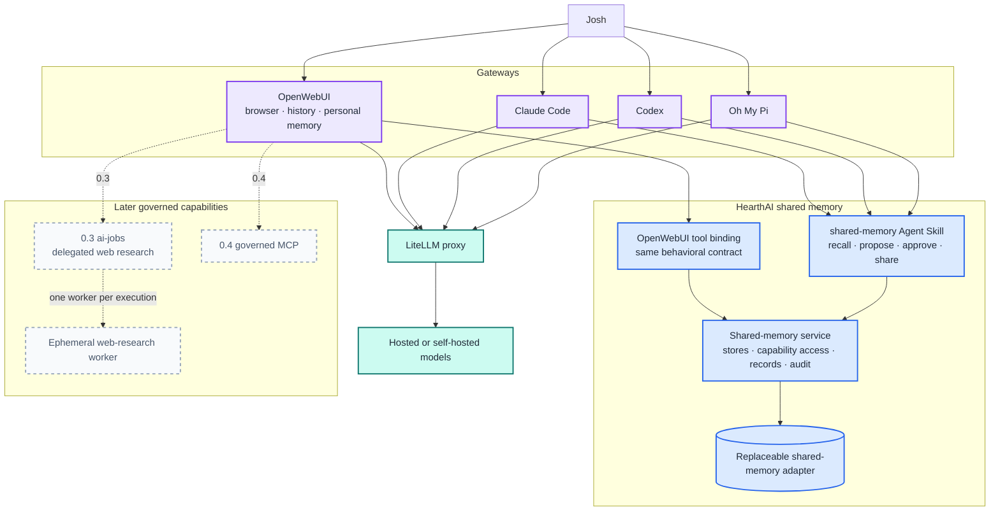
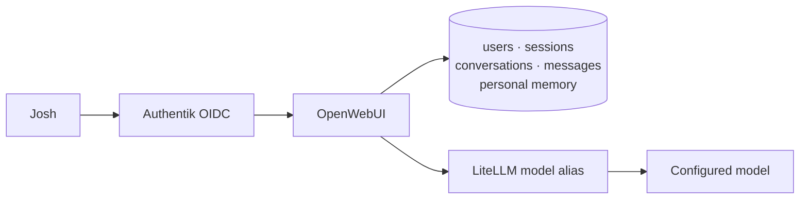
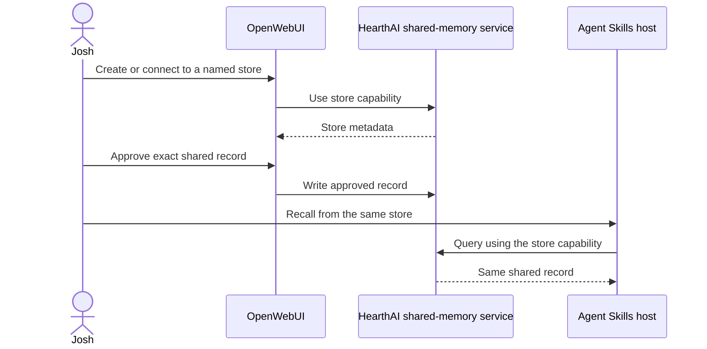
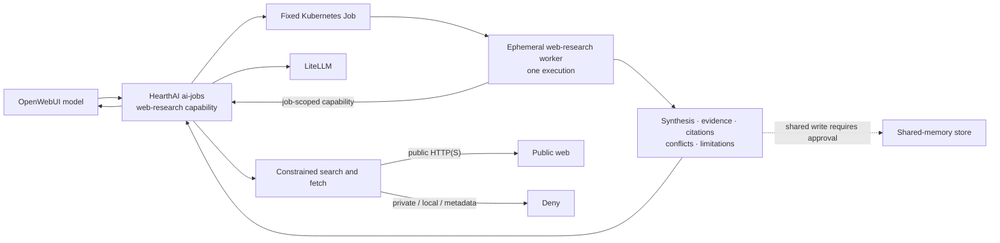
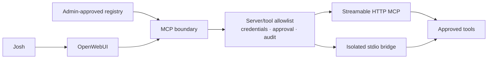

# HearthAI Architecture

**Status:** working architecture for the authoritative capability roadmap  
**Roadmap:** [`ROADMAP.md`](ROADMAP.md)  
**Design detail:** [`superpowers/specs/2026-08-30-capability-roadmap-design.md`](superpowers/specs/2026-08-30-capability-roadmap-design.md)

HearthAI's immediate product boundary is a useful OpenWebUI work surface: Git change work, bounded web research, and automatic topic organization. Shared memory remains a portable HearthAI capability that supports those workflows; governed MCP follows after the specific capability boundaries are exercised.

Long-term personal-memory ownership is unresolved. OpenWebUI supplies personal memory in 0.1; HearthAI initially specializes in deliberately shareable memory.

## Current capability priorities

- **Git change work:** the first execution profile, for any repository carrying both an explicit HearthAI authorization record and a GitHub App installation selection. See *Execution substrate* below for the materializer/worker/publisher split and its credential boundaries: the sandboxed worker holds no GitHub credential and runs repository-controlled checks, and only the separate publisher pod acts as `hearthai[bot]`. No merge authority.
- **Web research:** a bounded, cited capability with an isolated worker; not general browsing or execution.
- **Topic manager:** creates clean logical chats on topic shifts. Detection is HearthAI's, at the chat boundary, not the answering model's mid-response; the boundary defaults closed, so a false split costs a re-selected artifact rather than lost history. By default it provides no predecessor transcript to the model; only selected artifacts, named project/repository context, or a brief relevant task summary may cross the boundary. Keeping earlier topics navigable is chat-surface behavior OpenWebUI does not provide, so this capability may require relaxing the 0.1 *no custom frontend* exclusion — by an OpenWebUI extension if one suffices, otherwise by an explicit recorded decision.
- **Audit:** every consequential agent run is durably attributable to a request, agent identity, approval, repository, commits, checks, and external actor.

## Execution substrate

The **`ai-jobs` control plane** is HearthAI's distinct execution substrate. It admits typed,
model-callable capability requests, evaluates HearthAI authorization, selects a fixed reviewed
worker profile, creates the fixed set of ephemeral sandboxed pods that profile declares, and
records the run audit. The profile — never the caller — decides how many pods a run creates and
what each may reach. It is never a general Kubernetes Job API: callers cannot choose an image,
command, environment, mount, credential, network policy, resource limit, or service account.

A pod begins with no durable state, host mounts, Kubernetes API access, service-account token,
or ambient credentials. It has a read-only root filesystem except for explicit ephemeral
workspaces and fixed profile egress. Initial profiles do not expose generic tools to a model.
They contain only the machinery needed for that profile.

**Git change work is the first profile and the validation vehicle.** A repository-materializer init
container uses a short-lived, read-only token to fetch the authorized repository/ref to an
ephemeral workspace, then removes the token, Git credential configuration, and `.git` before the
worker starts (unless a fixed profile demonstrably requires history). A profile that does retain
history must have been fetched with the credential supplied out of band — `http.extraHeader` or an
equivalent — because removing `.git/config` keys alone leaves token residue in `FETCH_HEAD`,
`packed-refs`, and the reflog, all readable by the untrusted check code that shares the workspace.
The sandboxed worker can modify that workspace and run repository-controlled checks; those checks
are untrusted code and receive the same sandbox, resource, filesystem, and egress limits. When the
worker terminates, `ai-jobs` captures its change artifact and starts a **separate publisher pod**,
never a sidecar. The publisher refetches the repository, applies that artifact without executing
repository code, and receives a short-lived write-scoped installation token to perform only
branch/commit/PR operations as `hearthai[bot]`. The worker cannot reach the publisher over
localhost or a shared volume. Commit content remains worker-controlled by design; containment is
the branch, lack of merge authority, separate publisher, and audit. The GitHub App private key
remains outside every pod.

## Deployment trust model

HearthAI is intended to run locally in a private environment with a trusted server operator.
The operator can access stored memory and conversations. Operator-unreadable memory and privacy
isolation between mutually untrusted tenants are out of scope, not deferred release requirements.
Personal context remains separate between users in normal application use, and shared writes
still require approval of the exact content and destination.

This trust applies to the operator, not to models, tools, repository code, or fetched content.
Authentication, scoped access, credential protection, sandboxed execution, and action approvals
remain required. Local deployment does not require local inference: a configured hosted model
provider still receives the context sent to it.

## Product boundaries

```text
Gateway       OpenWebUI browser chat and gateway-local personal state
Skill         portable shared-memory behavior
Platform      shared-memory and governed capability services
Inference     LiteLLM model routing
```

## System architecture

> **Pending rewrite:** this diagram predates the execution substrate and the Git change profile. It
> shows `ai-jobs` as a later web-research-only capability and has no GitHub or topic-manager node.
> *Execution substrate* above and the priority correction in `ROADMAP.md` are authoritative.



## Component responsibilities

| Component | Owns | Does not own |
|---|---|---|
| **OpenWebUI** | Browser UI, streaming, conversations, OIDC sessions, near-term personal memory | HearthAI shared-memory semantics |
| **LiteLLM** | Model endpoint normalization and provider routing | HearthAI state or policy |
| **Shared-memory skill** | Store discovery, recall, record preparation, approval rules, service calls, honest failures | Browser UI, personal memory, fetch, MCP |
| **OpenWebUI shared-memory adapter** | Exposing the shared-memory contract as OpenWebUI tools and descriptions | Redefining stores or access |
| **Shared-memory service** | Store lifecycle, capability access, records, retrieval, audit, export | OpenWebUI account or personal-memory data |
| **`ai-jobs` control plane** | Typed capability admission, HearthAI authorization, profile selection, execution state, fixed Kubernetes Job lifecycle, result delivery, durable run audit, health, and metrics | General job execution, user-facing job administration, or model-selected runtime configuration |
| **Worker profile** | One bounded capability-specific worker contract, including sandbox, workspace, and output artifact rules | Durable state, provider or Kubernetes credentials, service-account tokens, a general shell, or caller-selected tools, image, or pod configuration |
| **Git change profile** | Ephemeral repository workspace, sandboxed repository checks, separate publish pod as `hearthai[bot]` | Direct use of the App private key, merge authority, arbitrary repository access, or worker-to-publisher access |
| **Topic manager** | Topic-shift detection at the chat boundary, logical conversation creation, navigable topic links, and the explicit carry-over set | Model context outside the carry-over set, transcript retention decisions, or deleting earlier topics |
| **MCP boundary** | Approved servers/tools, scoped credentials, audit, approvals | Bypassing sandbox or memory approval |

## Deployment ownership

HearthAI owns the cohesive application deployment, including Open WebUI: component
manifests, compatible image pins, configuration, service discovery, probes, application
storage defaults, and release automation live in `deploy/charts/hearthai`. The chart
bundles Open WebUI, LiteLLM (with the known-working home-ops catalogue), Meridian,
a single-instance CNPG Postgres cluster (enabled by default), and hearthmem
into one release, including internal WebUI-to-proxy wiring. The standalone memory chart remains
available. See [`deploy/README.md`](../deploy/README.md) for inputs and migration.

The separate `home-ops` repository selects a HearthAI release and supplies environment
inputs: namespace, public URL, ingress/TLS infrastructure, storage classes or existing
claims, identity-provider/shared-Postgres endpoints, proxy/provider Secrets, and cluster observability.
home-ops supplies the CNPG operator and Cilium. HearthAI owns the single-server
Postgres Cluster resource and Meridian wiring. With `postgres.enabled=false`,
LiteLLM uses the externally supplied database. No database data migrates automatically.
It should not reconstruct Open WebUI deployments or HearthAI's internal integration.

HearthAI also owns the `ai-jobs` contracts, control-plane and worker behavior. As that
runtime becomes deployable, its application RBAC, sandbox/network-policy templates,
and Open WebUI tool registration must ship here, parameterized by cluster inputs.
They are not deployed by the current chart; neither is the shared-memory adapter.
Bundling the existing services does not imply those model-callable capabilities exist.

Neither deployment configuration nor OpenWebUI may turn `ai-jobs` into a general job runner. The model-facing capability accepts research intent and bounded research options only; images, commands, environment variables, credentials, Kubernetes objects, shells, and filesystems remain out of scope.

## Memory architecture

### Personal memory

OpenWebUI built-in memory is the 0.1 personal-memory implementation. It provides model-managed add/search/update/delete behavior and user-facing review controls.

This is a near-term implementation choice, not a permanent ownership decision.

### HearthAI shareable memory

```text
shared-memory service
  ├── store: family
  ├── store: trip-planning
  └── store: project-x
```

A store is a named memory partition accessed by capability. It can be used by multiple hosts and, through out-of-band token transfer, by other people without a HearthAI-managed account system.

The initial sharing model is capability-based rather than identity-membership-based:

```text
store capability ─> access to one shared store
```

### Write policy

A model may recall from an available store. A shared write always requires a person to approve:

1. the exact durable content;
2. the exact destination store.

The model may propose; it may not silently share.

> **Pending rewrite:** the release diagram and the numbered `0.1`–`0.4` milestone sections that follow predate the execution substrate and the Git change profile. They still describe `ai-jobs` as a 0.3 web-research-only service. *Execution substrate* above and the current priority correction in `ROADMAP.md` are authoritative until those sections are rewritten.

## Release architecture


## 0.1 — OpenWebUI foundation

### Architecture



### Included

- OpenWebUI;
- Authentik through generic OIDC;
- Josh-only access;
- LiteLLM;
- streaming chat;
- server-side conversations;
- OpenWebUI built-in memory and Personalization UI;
- durable database and secret configuration.

### Excluded

- prescribed HearthAI persona;
- HearthAI shared-memory tools;
- web access;
- MCP;
- code execution;
- public signup and additional users;
- custom frontend.

### Acceptance

Josh authenticates, chats through LiteLLM, recovers conversations after restart, and can add/review/correct/delete OpenWebUI personal memory. No external tool is callable.

## 0.2 — HearthAI shareable memory

### Architecture



### Included

- existing shared-memory service;
- portable shared-memory skill;
- OpenWebUI tool binding;
- named stores;
- capability-token access;
- out-of-band capability sharing;
- store-specific recall;
- approval before every shared write;
- audit and provenance;
- cross-host access;
- backup and human-readable export.

### Explicit boundary

0.2 does not replace OpenWebUI personal memory and does not add a HearthAI private partition. Whether personal memory eventually moves into HearthAI remains unresolved.

### Acceptance

OpenWebUI and one Agent Skills-compatible host use the same named store. A host without its capability has no access. Every write records exact approved content and destination. Tokens never enter URLs, prompts, stored memories, or logs.

## 0.3 — Delegated web research with `ai-jobs`

### Layered boundary



OpenWebUI invokes one model-facing web-research capability. `ai-jobs` creates an internal execution record and one Kubernetes Job using a fixed worker image and policy. Research either returns a terminal result during that synchronous tool call or fails as `deadline_exceeded`; asynchronous continuation, job identifiers, and polling are not part of 0.3.

The worker uses LiteLLM plus constrained search and page-fetch operations brokered by `ai-jobs`. Provider credentials stay in the control plane, while the worker receives only a job-scoped HearthAI capability. Web content is untrusted evidence and cannot expand worker authority or bypass the existing approval boundary for shared-memory writes.

### Worker isolation

- a new ephemeral worker pod for every research execution;
- fixed image, command, resource policy, and runtime privileges controlled by HearthAI;
- no Kubernetes service-account token or Kubernetes API access;
- no host mounts, private volumes, browser sessions, or durable filesystem;
- no provider credentials in the worker;
- no network path to private, local, cluster, or cloud-metadata destinations, including redirects;
- bounded search, fetch, model use, runtime, and result size;
- cleanup of short-lived execution artifacts according to retention policy.

### Model-facing surface

The request contains a research question, optional bounded research depth or source budget, and integration-supplied correlation. It cannot select or provide:

- worker images or commands;
- Kubernetes objects or job configuration;
- environment variables or credentials;
- shell, filesystem, package, process, or Docker tools;
- arbitrary network access.

The returned research result is directly usable in conversation and contains a concise synthesis, individual findings with supporting evidence and source URLs, conflicts or uncertainty, and limitations. Failures use stable, actionable categories without exposing Kubernetes details.

### Acceptance

OpenWebUI can invoke research from a normal conversation; HearthAI runs one isolated ephemeral worker and returns a validated, cited result without user-managed polling or job IDs. Direct and redirected fetches cannot reach private destinations, workers contain neither provider nor Kubernetes credentials, fetched instructions cannot silently persist or expand authority, and the model cannot access a general execution surface.

## 0.4 — Governed MCP



MCP is introduced only after the web-research release establishes isolation, provenance, and approval rules. Tool output is untrusted and cannot silently write shared memory.

## Current repository state

### Built

- shared-memory Agent Skill;
- network shared-memory service;
- Markdown/frontmatter persistence;
- Git-per-write history;
- term-overlap retrieval;
- idempotent duplicate handling;
- Docker image and hardened single-replica Helm chart;
- service, image, chart, persistence, and shutdown tests.

### Not yet released through the roadmap

- OpenWebUI platform configuration;
- Authentik OIDC integration;
- LiteLLM configuration;
- OpenWebUI binding for the shared-memory service;
- `ai-jobs` execution substrate, worker-profile framework, Git change profile, and OpenWebUI integration;
- governed MCP configuration.

## Deferred architecture

No numbered release promises:

- HearthAI-managed user accounts;
- invitations and verified membership;
- household roles or guardianship;
- account recovery and deprovisioning;
- permanent personal-memory ownership;
- automatic discovery of other people.

These decisions follow evidence from 0.1 and 0.2.

## Technology decision status

| Concern | Status |
|---|---|
| OpenWebUI as initial platform | Approved for 0.1 |
| OpenWebUI built-in personal memory | Approved near-term; permanent ownership unresolved |
| Prescribed HearthAI persona | Excluded from 0.1 |
| Generic OIDC with Authentik | Approved for 0.1 |
| LiteLLM inference boundary | Approved for 0.1 |
| HearthAI shared-memory skill/service | Approved for 0.2 |
| Capability-token sharing | Approved starting model; scope/revocation still open |
| `ai-jobs` as the single execution substrate for every model-callable capability | Approved; supersedes its web-research-only scope |
| Profile-fixed set of ephemeral sandboxed pods per execution | Approved |
| Dedicated HearthAI GitHub App with `hearthai[bot]` as the acting identity | Approved; App private key stays outside every pod |
| Git change work as the first worker profile | Approved as the substrate's validation vehicle |
| Sandboxed execution of repository-controlled checks | Approved; the sandbox is fixed, the check behavior is not |
| Separate publisher pod holding the write-scoped installation token | Approved; sidecar publisher explicitly rejected |
| Merge authority for any HearthAI actor | Excluded |
| General shell or caller-configurable job execution | Excluded from every profile |
| Topic manager owning topic-shift detection and carry-over | Approved; whether it needs a surface beyond OpenWebUI is open |
| `ai-jobs` for delegated web research | Approved as one profile of the substrate |
| OpenWebUI native MCP | Approved integration surface for 0.4, subject to governance |
| Personal memory migration to HearthAI | Unresolved |
| Neo4j or graph backend | Deferred until a measured graph-shaped query exists |
| n8n | Deferred until a recurring asynchronous workflow exists |
| Rich multi-user identity | Deferred without a release number |

## Session recovery

Continue roadmap work from [`ROADMAP.md`](ROADMAP.md). Treat its **Current priority correction** and execution-substrate boundary as authoritative until the numbered milestones are rewritten. Older personal-memory implementation documents are archived context, not the current plan.
