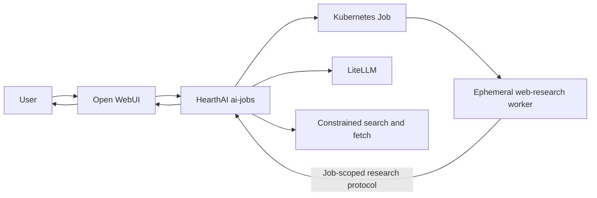

# AI Jobs Web Research Structural Plan

> **For the implementation session:** Use this document to create the task-level implementation plan before changing code.

**Goal:** Add `ai-jobs` to HearthAI so Open WebUI can transparently delegate web research to an ephemeral Kubernetes worker and receive a cited result without exposing infrastructure concepts to the user.

**Scope:** Architecture and repository structure only. This document deliberately does not select libraries, define manifests line-by-line, or prescribe implementation mechanics.

## Approved Direction

- The service is named **`ai-jobs`** and is part of HearthAI.
- `ai-jobs` is an independently deployable HearthAI service.
- Its first and only v1 capability is **web research**.
- Open WebUI remains the conversation and orchestration surface.
- HearthAI decides when and how to execute the capability; users do not submit or manage Kubernetes Jobs directly.
- Each research execution runs in a new ephemeral Kubernetes Job/pod.
- The worker uses LiteLLM plus constrained web search and page-fetch capabilities.
- The worker returns a structured, source-backed research result to the original Open WebUI conversation.
- Short requests may complete synchronously. Longer requests may continue asynchronously inside the orchestration layer, but job IDs and polling are not part of the user experience.
- There is no dedicated job dashboard. `ai-jobs` emits health and operational metrics for the existing observability stack.
- HearthAI owns behavior and release artifacts. `home-ops` owns cluster deployment and integration wiring.

## Intended User Experience

From the user’s perspective:

1. The user asks Open WebUI a question that requires current or deeper web research.
2. Open WebUI invokes the HearthAI research capability as part of answering.
3. HearthAI performs the research outside the main conversation process.
4. Open WebUI receives the resulting findings and citations.
5. The assistant answers normally.

The user does **not** need to:

- choose a worker image;
- create or inspect a Kubernetes Job;
- understand pods, queues, or namespaces;
- copy a job ID;
- poll for status;
- open a second interface;
- monitor or clean up the worker.

## System Shape



`ai-jobs` brokers the worker’s LiteLLM, search, and fetch operations. The worker receives only a job-scoped HearthAI capability; provider credentials remain in the control plane.

## Component Responsibilities

### Open WebUI

Owns:

- the conversation;
- deciding when the model invokes the HearthAI research tool;
- presenting the final answer and citations;
- keeping execution details out of the normal user experience.

Does not own:

- Kubernetes Job creation;
- worker lifecycle;
- research result persistence;
- job observability;
- provider credentials.

### `ai-jobs` control plane

Owns:

- the model-facing web-research capability contract;
- caller identity and authorization;
- request validation;
- Kubernetes Job creation and cleanup;
- job state and result delivery;
- synchronous waiting and hidden asynchronous continuation;
- worker-scoped authorization;
- operational health and metrics;
- stable failure reporting.

Does not expose:

- arbitrary images or commands;
- a general job runner;
- Kubernetes APIs to the model;
- a shell or filesystem tool;
- user-facing job administration.

### Web-research worker

Owns:

- planning and conducting one research task;
- searching for candidate sources;
- fetching and evaluating source material;
- using LiteLLM for the bounded research loop;
- returning a structured synthesis with citations and limitations.

Does not own:

- durable state;
- provider credentials;
- Kubernetes credentials;
- access to HearthAI shared memory;
- spawning additional jobs;
- arbitrary execution.

### `home-ops`

Owns:

- deploying the `ai-jobs` control plane;
- namespace and service configuration;
- namespace-scoped RBAC;
- worker and control-plane network policy;
- persistent storage for control-plane state;
- secret delivery from Bitwarden;
- Open WebUI tool registration;
- image and chart version pins;
- health and metrics collection.

Does not own:

- the research contract;
- worker behavior;
- orchestration semantics;
- application-level safety policy.

## Repository Structure

### HearthAI

```text
hearthai/
├── packages/
│   └── ai-job-contract/
│       ├── src/
│       └── tests/
├── service/
│   ├── ai-jobs/
│   │   ├── src/
│   │   │   ├── api/
│   │   │   ├── auth/
│   │   │   ├── jobs/
│   │   │   ├── kubernetes/
│   │   │   ├── providers/
│   │   │   └── observability/
│   │   ├── tests/
│   │   └── Dockerfile
│   └── web-research-worker/
│       ├── src/
│       │   ├── agent/
│       │   ├── tools/
│       │   └── lifecycle/
│       ├── tests/
│       └── Dockerfile
├── deploy/
│   └── charts/
│       └── ai-jobs/
└── docs/
```

Responsibilities should determine module boundaries. The implementation session may flatten folders that would otherwise contain only one file.

### Home-ops

```text
home-ops/
├── kubernetes/apps/
│   ├── ai-jobs/
│   │   ├── namespace.yaml
│   │   ├── kustomization.yaml
│   │   └── ai-jobs/
│   │       ├── ks.yaml
│   │       └── app/
│   │           ├── helmrelease.yaml
│   │           ├── externalsecret.yaml
│   │           ├── networkpolicy.yaml
│   │           ├── monitoring.yaml
│   │           └── kustomization.yaml
│   └── ai/open-webui/
│       └── app/helmrelease.yaml
└── terraform/bitwarden/
```

## Contracts to Define Before Implementation

### Research request

The model-facing request should contain only research intent and bounded research options. It must not accept Kubernetes concepts, images, commands, environment variables, credentials, or raw pod configuration.

Minimum semantic fields:

- research question;
- optional research depth or source budget;
- conversation/request correlation supplied by the integration layer.

### Research result

The result should be directly usable by the orchestrating model.

Minimum semantic fields:

- concise synthesis;
- individual findings;
- evidence associated with each finding;
- source URLs;
- conflicts or uncertainty;
- limitations and incomplete areas.

### Execution state

Internally, `ai-jobs` needs states equivalent to:

```text
accepted → starting → running → succeeded
                              → failed
                              → timed out
                              → cancelled
```

These states support orchestration and metrics. They are not a user-facing workflow.

### Failure contract

Failures should identify what the orchestrating model can do next without exposing Kubernetes details. Required categories:

- invalid research request;
- temporary capacity unavailable;
- research deadline exceeded;
- search or model provider unavailable;
- unsafe or unsupported fetch target;
- invalid worker result;
- internal orchestration failure.

## Execution Lifecycle

1. Open WebUI invokes HearthAI’s web-research capability.
2. `ai-jobs` authenticates the caller and validates the request.
3. `ai-jobs` creates an internal execution record.
4. `ai-jobs` creates one Kubernetes Job using the fixed web-research worker image and policy.
5. The worker claims only that execution.
6. The worker conducts bounded research using LiteLLM and the approved search/fetch path.
7. The worker submits a structured result or stable failure.
8. `ai-jobs` validates and stores the terminal result.
9. `ai-jobs` returns the result to Open WebUI, either during the initial wait or through hidden continuation.
10. Kubernetes and `ai-jobs` remove short-lived execution artifacts according to retention policy.

## Trust and Isolation Boundaries

The implementation must preserve these structural properties:

- The model cannot choose the worker image, command, runtime privileges, or network policy.
- The worker has no Kubernetes service-account token.
- The worker has no host mount, private volume, browser session, or durable filesystem.
- The worker cannot reach private, local, cluster, or metadata destinations through web fetches or redirects.
- Provider credentials remain outside model context and fetched content.
- Web content is untrusted evidence, never executable instruction.
- Web-influenced output cannot write HearthAI shared memory without the existing approval boundary.
- Result and audit logs do not contain secrets or full fetched content.
- Kubernetes permissions are limited to the dedicated namespace and required resource types.

The implementation session should choose the simplest mechanism that enforces each property. This plan does not prescribe low-level networking or DNS techniques.

## Metrics Boundary

`ai-jobs` should emit enough data for the existing observability stack to answer:

- Is the service healthy and ready?
- How many research jobs are waiting or running?
- How many completed, failed, or timed out?
- How long do jobs wait and run?
- Are failures coming from orchestration, the worker, search, or LiteLLM?
- Are results failing to reach Open WebUI?

Metrics must not label or contain:

- user IDs;
- conversation IDs;
- research questions;
- fetched URLs or content;
- citations;
- provider credentials;
- per-job identifiers.

No dedicated dashboard is part of v1.

## Delivery Phases

### Phase 1: Align HearthAI architecture

- [ ] Replace the milestone 0.3 Open Terminal hypothesis in `docs/ARCHITECTURE.md` with `ai-jobs` and ephemeral workers.
- [ ] Update `docs/ROADMAP.md` to describe delegated web research as the milestone outcome.
- [ ] Record the HearthAI/home-ops ownership split.
- [ ] Confirm that general shell access remains out of scope.

**Exit condition:** The canonical documents describe the same architecture as this plan.

### Phase 2: Define shared contracts

- [ ] Add the request, result, execution-state, and failure contracts.
- [ ] Define the Open WebUI-facing capability without Kubernetes terminology.
- [ ] Define the worker/control-plane protocol.
- [ ] Define which fields may enter logs and metrics.

**Exit condition:** Control plane, worker, and Open WebUI integration can be built independently against stable contracts.

### Phase 3: Build the `ai-jobs` control plane

- [ ] Add caller authentication and authorization.
- [ ] Add durable execution state and result storage.
- [ ] Add fixed Kubernetes Job creation and lifecycle reconciliation.
- [ ] Add worker-scoped authentication.
- [ ] Add synchronous wait and hidden continuation behavior.
- [ ] Add health, readiness, metrics, and stable errors.

**Exit condition:** The service can run a fixed test worker from request through terminal result without exposing general execution.

### Phase 4: Build the web-research worker

- [ ] Add the bounded research loop.
- [ ] Add constrained search and fetch tools.
- [ ] Add LiteLLM access through the approved credential boundary.
- [ ] Add source tracking, result validation, conflicts, and limitations.
- [ ] Ensure fetched instructions cannot expand worker authority.

**Exit condition:** One ephemeral worker can return a valid cited research result and fails cleanly when it cannot.

### Phase 5: Package HearthAI artifacts

- [ ] Build separate control-plane and worker images.
- [ ] Add an `ai-jobs` Helm chart.
- [ ] Extend CI for contracts, service behavior, worker behavior, image builds, and chart rendering.
- [ ] Extend releases without changing existing hearthmem guarantees.

**Exit condition:** A versioned HearthAI release contains both images and the deployment chart.

### Phase 6: Integrate through home-ops

- [ ] Add the dedicated namespace and Flux Kustomization.
- [ ] Deploy the pinned HearthAI chart.
- [ ] Add namespace-scoped RBAC, storage, and network policy.
- [ ] Deliver LiteLLM and search-provider credentials through External Secrets.
- [ ] Register the HearthAI research capability in Open WebUI.
- [ ] Add health and metrics scraping to existing observability.

**Exit condition:** Flux reconciles the service and Open WebUI can discover the capability without click-ops.

### Phase 7: Verify the experience

- [ ] Ask a normal current-information question in Open WebUI.
- [ ] Confirm a new worker Job appears and terminates.
- [ ] Confirm Open WebUI receives a source-backed result.
- [ ] Confirm longer execution completes without asking the user to poll.
- [ ] Confirm unsafe web destinations and malformed results fail closed.
- [ ] Confirm worker pods contain no provider or Kubernetes credentials.
- [ ] Confirm completed execution artifacts are cleaned up.
- [ ] Confirm existing HearthAI and home-ops validation remains green.

**Exit condition:** The capability feels like HearthAI researching, not the user operating a Kubernetes job system.

## Out of Scope for v1

- additional worker types;
- user-selectable images or commands;
- arbitrary agent sandboxes;
- a general-purpose queue product;
- recurring or scheduled jobs;
- job priorities;
- multi-cluster execution;
- distributed control-plane replicas;
- a dedicated dashboard;
- user-facing job history;
- Open Terminal or general shell tools;
- direct writes to shared memory;
- zero-downtime worker or control-plane upgrades.

## Final Structural Acceptance

The implementation is complete only when all of these are true:

- Open WebUI can invoke one HearthAI web-research capability from a normal conversation.
- HearthAI creates one isolated ephemeral Kubernetes worker per execution.
- The worker returns a validated synthesis with evidence, citations, conflicts, and limitations.
- Short and long executions are handled without user-managed polling or job IDs.
- No model-facing interface exposes Kubernetes, shell, filesystem, image, command, or credential controls.
- Workers have no Kubernetes credentials, provider credentials, durable storage, or private-network access.
- The service emits health and aggregate metrics without a new dashboard or sensitive labels.
- HearthAI contains the contracts, services, worker, images, chart, tests, and release logic.
- `home-ops` contains only deployment, secrets, policy, observability, and Open WebUI wiring.
- Existing hearthmem behavior and release guarantees remain intact.
