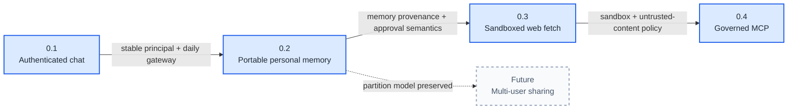

# HearthAI Capability Roadmap Design

**Status:** approved in conversation; awaiting written-spec review  
**Date:** 2026-08-30  
**Scope:** single-user releases 0.1–0.4; multi-user sharing explicitly deferred

## Problem

HearthAI has a broad architectural vision and a working shared-memory service, but it does not yet have a product surface Josh can use every day. Beginning with memory internals, graph storage, or orchestration creates infrastructure before product feedback.

The roadmap therefore starts with a usable browser conversation surface and adds one coherent capability per release. Commodity platform concerns use OpenWebUI, Authentik, and LiteLLM. HearthAI-owned code begins where the project has distinctive semantics: portable partitioned memory, safe untrusted-content handling, and governed external capabilities.

## Product model

HearthAI consists of four replaceable layers:

```text
Gateway       where the conversation happens
Skill         portable partitioned-memory behavior
Platform      durable state and governed capabilities
Inference     model access and routing
```

### Gateway

OpenWebUI is the first gateway. It owns browser chat, server-side conversation history, streaming UI, and OIDC session handling. It is replaceable and does not own HearthAI's long-term memory model.

### Skill

The HearthAI Agent Skill defines partitioned-memory behavior and how a host connects to the memory service. It owns:

- discovering available memory partitions;
- recalling relevant memory;
- writing into the principal's private partition;
- applying approval rules to non-private destinations when sharing eventually exists;
- invoking the memory-service API;
- reporting persistence and access failures honestly.

Agent Skills-compatible hosts consume `SKILL.md`. OpenWebUI receives the same behavior through its model/system prompt and memory-tool descriptions because it does not natively load Agent Skills.

### Platform

The HearthAI platform grows release by release. It eventually provides identity-bound personal memory, safe external-information access, and governed tool interoperability. Platform services expose host-neutral contracts so the skill can work from OpenWebUI, Claude Code, Codex, Oh My Pi, or another host.

### Inference

LiteLLM is the only inference boundary in the initial roadmap. HearthAI and OpenWebUI use a configured model alias rather than provider-specific APIs or an initial model picker.

## Cross-cutting principles

1. Every release is usable by itself.
2. 0.1–0.4 are single-user releases and make no multi-user product claim.
3. Generic OIDC establishes a real principal in 0.1 even though only Josh is admitted.
4. Conversation history is not long-term memory.
5. OpenWebUI is used aggressively for commodity UI and host features, but distinctive HearthAI semantics remain host-independent.
6. The HearthAI skill is specifically a partitioned-memory skill, not the definition of every platform capability.
7. Tool capability expands from none, to memory only, to one constrained untrusted-content tool, to governed MCP.
8. Protocol support is not a security boundary; MCP follows sandbox and policy work.
9. Shareable memory stores remain part of the long-term vision but have no release number until a credible multi-user path exists.

## 0.1 — Authenticated HearthAI chat

### Purpose

Create a deployable browser product Josh can use daily before HearthAI owns memory or tool execution.

### Composition

- OpenWebUI as the browser gateway;
- generic OIDC with Authentik as the first provider;
- Josh-only admission;
- LiteLLM as the model-access endpoint;
- one configured HearthAI model alias;
- one versioned HearthAI persona/system prompt;
- streaming responses;
- server-side conversations and messages;
- new, reopen, rename, and delete conversation behavior;
- logout and session expiry.

### Disabled capabilities

- OpenWebUI built-in memory;
- HearthAI memory-service integration;
- web search and URL fetch;
- OpenAPI tools;
- MCP;
- code execution and Open Terminal;
- arbitrary model selection;
- public signup or invitations.

### Data boundary

OpenWebUI stores user, session, conversation, and message data. This is gateway state, not portable HearthAI memory. The OIDC identity must be stable enough to map to a future HearthAI principal, but 0.1 does not introduce a separate identity service.

### Acceptance

1. Josh is redirected through Authentik and can log in and out.
2. An unauthenticated browser cannot reach chat history or the model.
3. The configured HearthAI persona streams an answer through LiteLLM.
4. Closing and reopening the browser preserves conversations.
5. Starting a new conversation does not expose tools, memory, web search, MCP, or code execution.
6. Restarting OpenWebUI preserves the account and conversation history.

### What 0.1 teaches

- whether a browser gateway is useful enough to become daily infrastructure;
- whether the persona feels recognizably like HearthAI;
- whether OpenWebUI and LiteLLM are acceptable commodity boundaries;
- which interaction and deployment friction matters before memory exists.

## 0.2 — Per-person LLM-managed memory

### Purpose

Make HearthAI continuous across conversations and hosts through a portable partitioned-memory skill and a HearthAI-owned memory service.

### Partition model

The single-user release has exactly one principal and one private partition:

```text
principal: Josh
  └── private partition — exactly one, unshareable
```

The service and contracts may use a general partition abstraction, but 0.2 exposes no shared stores, invitations, memberships, or cross-principal operations.

### Composition

- HearthAI memory service;
- stable principal mapping from Josh's OIDC identity;
- exactly one unshareable private partition;
- host-neutral memory API;
- portable `SKILL.md` for Agent Skills-compatible hosts;
- OpenWebUI memory-tool adapter using the same service;
- model-managed add, search, update, and delete operations;
- user-visible memory review, correction, and deletion;
- host provenance and timestamps;
- backend-neutral export and backup.

### Memory behavior

Private memory may be managed autonomously by the model because only Josh can access it. The skill defines when to recall, what is durable enough to save, how to avoid duplicates, and how to correct or delete stale memory.

The model must never claim a failed write succeeded. Memory changes must remain inspectable and reversible by Josh.

### Portability proof

0.2 is not complete if memory works only inside OpenWebUI. At least one Agent Skills-compatible host—Claude Code, Codex, or Oh My Pi—must connect through the skill to the same private partition.

### Acceptance

1. OpenWebUI saves a memory through the HearthAI service.
2. Another skill-compatible host recalls the same record.
3. The second host corrects the memory and OpenWebUI sees the correction.
4. Restarting either host does not change the durable record.
5. Josh can review and delete memories without asking the model.
6. No host can create or request another principal or shared partition.
7. Export contains the complete private partition in a documented, host-neutral format.

### What 0.2 teaches

- whether cross-host memory creates meaningful continuity;
- whether model-managed memory quality is tractable;
- whether the partition model and skill are understandable;
- which retrieval failures justify backend evolution.

## 0.3 — Sandboxed web search and fetch

### Purpose

Allow HearthAI to use current external information while treating fetched content as untrusted and withholding general execution.

### Composition

- dedicated search/fetch capability boundary;
- outbound HTTP and HTTPS only;
- DNS and resolved-address checks;
- private, loopback, link-local, cluster, and cloud-metadata destinations blocked;
- no ambient credentials or browser session reuse;
- redirect, timeout, content-type, and response-size limits;
- extracted text plus source URL and fetch metadata;
- explicit untrusted-content provenance;
- audit events without fetched content or secrets.

OpenWebUI may provide the gateway UX and model tool registration, but the security boundary belongs to HearthAI's fetch capability rather than the OpenWebUI process.

### Memory interaction

A conversation that incorporates web content becomes web-tainted for memory purposes. The model may use fetched information in its response, but it cannot autonomously persist that information. Every memory write influenced by fetched content requires Josh to approve the exact content and destination private partition.

### Acceptance

1. HearthAI searches and fetches an allowed public page and cites its source.
2. It cannot reach loopback, RFC1918, link-local, Kubernetes, or cloud-metadata targets.
3. Redirects cannot escape the destination policy.
4. Oversized, binary, or timed-out responses fail explicitly.
5. Page instructions cannot trigger a memory write without Josh's approval.
6. The capability has no shell, filesystem, arbitrary socket, or general code-execution surface.

### What 0.3 teaches

- whether external information materially improves HearthAI;
- whether taint and approval rules are tolerable;
- which policy, provenance, and isolation mechanisms MCP must inherit.

## 0.4 — Governed MCP interoperability

### Purpose

Add broad external capabilities after one constrained tool has established the security and approval model.

### Composition

- admin-approved MCP server registry;
- native Streamable HTTP MCP through OpenWebUI where available;
- stdio MCP only through an isolated bridge;
- server and tool allowlists;
- explicit assignment to Josh;
- credentials outside model context;
- OAuth per-user authorization where supported;
- audit of server, tool, principal, risk classification, approval, and outcome;
- approval gates for consequential or state-changing operations;
- network and filesystem policy inherited from the sandbox boundary.

`WEBUI_SECRET_KEY` and related token-encryption settings are durable deployment secrets before OAuth-connected MCP is enabled.

### Relationship to memory

MCP tools do not bypass memory semantics. A tool result is external input. Any resulting memory write follows the same provenance and approval rules as other untrusted content. The MCP protocol does not create, broaden, or override memory partitions.

### Acceptance

1. Only an administrator can register an MCP server.
2. Only allowlisted servers and tools are visible to Josh.
3. Credentials never enter prompts or tool arguments visible to the model.
4. An unapproved server or tool cannot be invoked.
5. Consequential operations stop for approval.
6. Revoking access prevents the next invocation.
7. Tool output cannot silently modify memory.
8. OpenWebUI restart preserves encrypted OAuth connection state.

### What 0.4 teaches

- whether general interoperability is useful after governance cost;
- which integrations deserve first-class platform support;
- whether OpenWebUI's MCP boundary remains acceptable or needs a separate broker.

## Deferred — Multi-user and shareable memory stores

Shareable stores are not assigned a near-term version. A multi-user release requires a credible design and operational path for:

- user provisioning and deprovisioning;
- invitations and membership acceptance;
- account recovery and identity changes;
- shared-store ownership and administration;
- shared-write approval UX;
- membership and credential revocation;
- household, guardian, or other relationship semantics;
- operator access and privacy guarantees;
- audit and incident response.

The eventual memory shape remains:

```text
principal
  ├── private partition — exactly one, never shareable
  └── shared stores — user-created, explicit membership
```

The 0.2 service must not make this future impossible, but it must not expose fictional multi-user APIs before the trust model exists.

## Dependency graph



## Release discipline

A release advances only after its user-facing acceptance scenarios pass in the deployed environment. The next release does not begin because the previous code compiles; it begins because the prior capability is usable and its boundaries survived real use.

Each release updates:

- `docs/ARCHITECTURE.md` with built versus planned status;
- deployment configuration and rollback instructions;
- threat model for any new trust boundary;
- live acceptance evidence;
- the portable skill when memory behavior changes.

## Explicitly outside this roadmap

- public signup;
- invited household users;
- shareable stores on a named release;
- custom greenfield web UI;
- direct model-provider integration;
- model marketplace or arbitrary model picker;
- unsandboxed shell or code execution;
- autonomous proactivity and notifications;
- graph database migration without a captured graph-shaped query;
- n8n without a recurring asynchronous workflow.

## OpenWebUI source grounding

The roadmap relies on these documented OpenWebUI extension surfaces:

- [Generic OIDC and OAuth configuration](https://docs.openwebui.com/features/authentication-access/auth/sso/)
- [Model-managed memory and personalization](https://docs.openwebui.com/features/chat-conversations/memory/)
- [Agentic web search and URL fetching](https://docs.openwebui.com/features/chat-conversations/web-search/agentic-search/)
- [Native Streamable HTTP MCP support](https://docs.openwebui.com/features/extensibility/mcp/)
- [OpenAPI tool-server integration](https://docs.openwebui.com/features/extensibility/plugin/tools/openapi-servers/open-webui/)
