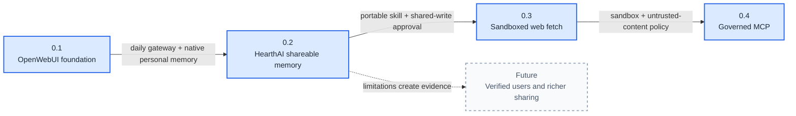

# HearthAI Capability Roadmap Design

**Status:** authoritative roadmap design  
**Date:** 2026-08-30  
**Scope:** releases 0.1–0.4; richer identity and personal-memory ownership explicitly unresolved

## Problem

HearthAI has a broad vision and a working shared-memory service, but it does not yet have a browser product Josh uses every day. The roadmap must deliver usable capability before speculative infrastructure while preserving HearthAI's distinctive portable shared-memory model.

## Product model

```text
Gateway       where conversation and gateway-local state live
Skill         portable shared-memory behavior
Platform      shared-memory and governed capability services
Inference     model access and routing
```

### Gateway

OpenWebUI is the first gateway. It owns browser chat, streaming, conversation history, OIDC sessions, and the near-term personal-memory implementation.

OpenWebUI is replaceable. Its near-term ownership of personal memory is not a permanent architecture decision.

### Skill

The HearthAI Agent Skill defines shareable-memory behavior and how a host connects to the HearthAI service. It owns:

- discovering named shared stores;
- recalling from a selected store;
- preparing durable, self-contained memory records;
- requiring approval for the exact content and destination before shared writes;
- invoking the memory-service API;
- reporting persistence and access failures honestly.

Agent Skills-compatible hosts consume `SKILL.md`. OpenWebUI receives equivalent behavior through its model/tool descriptions because it does not natively load Agent Skills.

### Platform

The near-term HearthAI platform owns deliberately shareable memory stores, then safe external-information access, then governed MCP interoperability.

It does not own personal memory in the numbered roadmap. Whether it should do so later is an open decision.

### Inference

LiteLLM is the model-access boundary. OpenWebUI uses a configured model alias rather than provider-specific integration or an initial model picker.

## Roadmap principles

1. Every release is usable by itself.
2. 0.1 uses OpenWebUI as a platform rather than building a custom UI.
3. 0.1 does not prescribe a HearthAI persona; identity should emerge organically from use.
4. OpenWebUI built-in memory remains enabled in 0.1.
5. 0.2 adds HearthAI shared memory without replacing personal memory.
6. Capability-token sharing does not require a HearthAI multi-user account system.
7. Shared writes require approval of exact content and destination.
8. Tool capability expands from no external tools, to shared memory, to constrained web access, to governed MCP.
9. Protocol support is not a security boundary; MCP follows sandbox, provenance, and approval work.
10. Long-term personal-memory ownership is unresolved.

## 0.1 — OpenWebUI foundation

### Purpose

Establish a useful browser chat platform with the fewest HearthAI-specific assumptions.

### Composition

- OpenWebUI;
- generic OIDC with Authentik as the first provider;
- Josh-only admission;
- LiteLLM as the model endpoint;
- streaming responses;
- server-side conversation history;
- OpenWebUI built-in per-user memory;
- Personalization UI for memory review, correction, and deletion;
- durable database and gateway secrets;
- new, reopen, rename, and delete conversations;
- logout and session expiry.

### Deliberately absent

- prescribed HearthAI persona or large system prompt;
- HearthAI shared-memory integration;
- external OpenAPI tools;
- web search and URL fetch;
- MCP;
- code execution and Open Terminal;
- arbitrary model selection;
- public signup, invitations, or additional users;
- custom frontend.

### Data boundary

OpenWebUI owns account, session, conversation, message, and personal-memory data in 0.1. This is an implementation choice for the first platform release, not a permanent personal-memory ownership decision.

### Acceptance

1. Josh logs in and out through Authentik.
2. An unauthenticated browser cannot access conversations or models.
3. Chat streams through a configured LiteLLM alias.
4. Conversations survive browser and OpenWebUI restarts.
5. OpenWebUI personal memory can be added, recalled, reviewed, corrected, and deleted.
6. External tools, web access, MCP, and code execution are unavailable.

### Learning goals

- Is OpenWebUI useful enough for daily use?
- Is its native memory valuable and trustworthy enough?
- Are Authentik, LiteLLM, and OpenWebUI acceptable commodity boundaries?
- What HearthAI-specific behavior emerges organically without a prescribed persona?

## 0.2 — HearthAI shareable memory

### Purpose

Add HearthAI's distinctive portable capability: deliberately shareable memory stores accessible across hosts or people without requiring HearthAI-managed user accounts.

### Composition

- existing HearthAI shared-memory service;
- portable `shared-memory` Agent Skill;
- OpenWebUI tool binding to the same API;
- user-created named stores;
- capability-token access;
- out-of-band token transfer;
- store-specific recall;
- approval before every shared write;
- provenance and audit history;
- backup and human-readable export;
- at least one OpenWebUI-to-Agent-Skill cross-host round trip.

### Memory separation

```text
OpenWebUI native memory
  = near-term personal memory

HearthAI memory service
  = deliberately shareable stores
```

0.2 does not create a HearthAI private partition or replace OpenWebUI personal memory. This is a release boundary, not a permanent decision about personal-memory ownership.

### Access model

A store is accessed through a capability token transferred outside a HearthAI account system. The release introduces no user directory, invitations, roles, household model, or verified membership.

The current implementation uses one unrevocable full-access token. Before 0.2 is complete, the project must either:

- implement the required token scope and revocation behavior; or
- explicitly accept and document the current limitations as part of the release.

Tokens never appear in URLs, prompts, stored memory, commit messages, or operational logs.

### Write policy

Every shared write requires human approval of:

1. the exact content;
2. the destination store.

The model may propose a write but may not perform one autonomously.

### Acceptance

1. Josh creates a named shared store.
2. OpenWebUI and one Agent Skills-compatible host access the same store.
3. A record written through one host is recalled through the other.
4. No shared write occurs without approval of exact content and destination.
5. A host without the capability cannot list, read, or write the store.
6. Tokens do not appear in prohibited surfaces.
7. Store contents remain readable and exportable independently of either host.

### Learning goals

- Does shared memory add value beyond OpenWebUI personal memory?
- Is the skill portable and understandable?
- Is capability sharing sufficient without account-level membership?
- Are revocation and separate read/write scopes required?
- Does experience suggest that personal memory should remain gateway-owned or move toward HearthAI?

## 0.3 — Sandboxed web search and fetch

### Purpose

Use current external information without granting general execution or treating fetched content as trusted.

### Preferred implementation hypothesis

Run web research in a dedicated Open Terminal Docker environment, but place a narrow HearthAI facade in front of it. The model receives only `search_web` and `fetch_url`, not Open Terminal's general shell and file tools.

The terminal is an isolation substrate, not the model-facing capability contract.

### Composition

- dedicated `web-research` Open Terminal container;
- custom minimal image or fixed startup package set;
- narrow OpenAPI or MCP facade exposing search and fetch only;
- terminal API credential held by the facade, outside model context;
- egress firewall and public HTTP/HTTPS only;
- DNS and redirect revalidation;
- private, loopback, link-local, cluster, and cloud-metadata destinations blocked;
- no host Docker socket, private volumes, ambient credentials, or browser sessions;
- response-size, type, redirect, and timeout limits;
- extracted content plus source provenance;
- fetched content marked untrusted;
- content-free operational audit;
- approval before web-influenced shared-memory writes.

### Acceptance

1. HearthAI fetches and cites an allowed public page.
2. Direct and redirected requests cannot reach internal or metadata targets.
3. Unsupported, oversized, binary, and timed-out responses fail explicitly.
4. Fetched instructions cannot invoke tools or write shared memory without approval.
5. The model cannot access `run_command`, file write, package installation, process management, Docker, arbitrary sockets, or other general terminal tools.

### Learning goals

- Does external information materially improve HearthAI?
- Are provenance and approval rules tolerable?
- Which sandbox and policy mechanisms MCP must inherit?

## 0.4 — Governed MCP

### Purpose

Add broader interoperability after a constrained untrusted-content capability has established policy, audit, and approval behavior.

### Composition

- admin-approved MCP server registry;
- native Streamable HTTP MCP through OpenWebUI;
- stdio only through an isolated bridge;
- server and tool allowlists;
- assignment to Josh;
- credentials outside model context;
- per-user OAuth where supported;
- durable OpenWebUI encryption keys;
- audit and revocation;
- approval gates for consequential actions;
- MCP output treated as untrusted for shared-memory purposes.

### Acceptance

1. Only an administrator registers MCP servers.
2. Only approved servers and tools are visible and callable.
3. Credentials remain outside model-visible prompts and arguments.
4. Consequential operations stop for approval.
5. Revocation blocks the next invocation.
6. Tool output cannot silently modify HearthAI shared memory.
7. OpenWebUI restart preserves encrypted OAuth state.

### Learning goals

- Is general interoperability worth its governance cost?
- Which integrations deserve first-class platform support?
- Does OpenWebUI's MCP boundary remain acceptable or require a separate broker?

## Future — Verified sharing and identity

No numbered release promises:

- HearthAI-managed user accounts;
- invitations or membership acceptance;
- verified store membership;
- household roles or guardianship;
- account recovery or deprovisioning;
- operator-unreadable private memory;
- automatic discovery of other people.

These follow only if 0.2 proves capability-based stores valuable and exposes concrete limitations.

## Unresolved personal-memory ownership

OpenWebUI owns personal memory in 0.1 because it already provides a useful model-managed system and review UI. The roadmap does not decide whether that remains permanent.

Possible future directions include:

- retain OpenWebUI personal memory permanently;
- export or synchronize it for portability;
- migrate personal memory into HearthAI;
- support multiple interchangeable personal-memory providers.

No direction is preferred until 0.1 and 0.2 produce evidence.

## Dependency graph



## Open decisions

1. Does 0.2 require revocable tokens?
2. Are separate read and write capabilities necessary?
3. How does OpenWebUI receive skill-equivalent shared-memory behavior?
4. Who owns personal memory long term?
5. Which Agent Skills-compatible host proves 0.2 portability?
6. Is Open Terminal the final 0.3 substrate, and should its narrow facade use OpenAPI or MCP?
7. Which MCP integration justifies 0.4?

## Release discipline

A release advances only after its deployed acceptance scenarios pass. Compiling infrastructure is not a release boundary.

Every release updates:

- `docs/ROADMAP.md`;
- `docs/ARCHITECTURE.md`;
- relevant threat model;
- deployment and rollback instructions;
- live acceptance evidence;
- the shared-memory skill when its behavior changes.

## OpenWebUI source grounding

- [Generic OIDC and OAuth](https://docs.openwebui.com/features/authentication-access/auth/sso/)
- [Model-managed memory](https://docs.openwebui.com/features/chat-conversations/memory/)
- [Agentic web search and URL fetching](https://docs.openwebui.com/features/chat-conversations/web-search/agentic-search/)
- [Native Streamable HTTP MCP](https://docs.openwebui.com/features/extensibility/mcp/)
- [OpenAPI tool-server integration](https://docs.openwebui.com/features/extensibility/plugin/tools/openapi-servers/open-webui/)
- [Open Terminal integration](https://docs.openwebui.com/features/open-terminal/)
- [Open Terminal implementation and container security options](https://github.com/open-webui/open-terminal)
