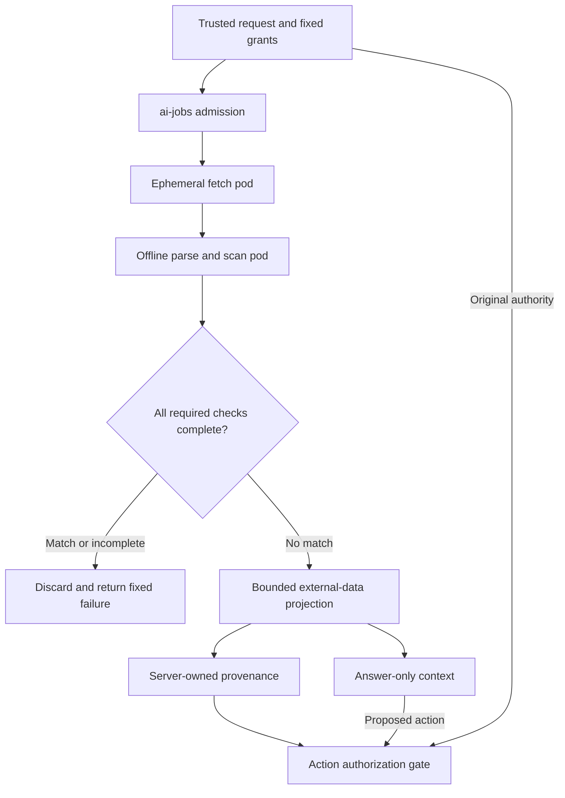

# Isolated webfetch and response rejection

**Status:** proposed architecture; planning only, no runtime implementation.
**Date:** 2026-09-12.
**Baseline reviewed:** main at b92bfdab9dae8b2773c265cd8aa48b4f34c37c32.
**Implementation plan:** [webfetch plan](../plans/2026-09-12-isolated-webfetch.md).

## Decision and scope

Add a versioned `web_fetch` capability and reuse its response-admission pipeline
inside `web_research`. Fetch, parsing, scanning, and optional evidence processing
execute in fixed ephemeral profiles owned by `ai-jobs`. No raw response reaches
the privileged planner, Open WebUI's generic URL loader, or a model before admission.

**Reject the entire response whenever any enabled enforcement detector triggers.**
No redaction-and-continue, confidence-based override, model-requested bypass, or
returning the suspicious passage in an error. An incomplete scan also releases no
content. Rejection is a content-admission decision, separate from transport success.

Support operator-managed YARA rules, initially through YARA-X. They are one
deterministic detector behind a small interface, not a proof that accepted content
is safe. Every accepted excerpt, summary, title, citation, and derived value retains
server-owned external provenance. A detector may deny admission; it may never
bless content or authorize actions.

This implements the user's reject-on-detection requirement alongside SPEC §6,
§7, and §11.1. It does not replace isolation or the deterministic authorization
boundary. Git change work remains the first substrate validation profile.

## Current repository and precedence

The repository has `WebResearchDefinition`, request/result validation, a tool
registry, `RunService`, and an executor protocol. The worker package contains
contract scaffolding. A production fetch broker, scanner, Kubernetes execution
pipeline, and session-level enforcement are still implementation work.

The September 7 research plan anticipated brokered fetching but did not specify
this response gate. This design supersedes that plan's raw-response handling,
one-pod assumption where isolation requires separate stages, and deployment
handoff: application profiles, policy templates, and tool registration belong in
HearthAI's cohesive chart; home-ops supplies cluster inputs. The older plan remains
useful for lifecycle, authentication, deadlines, and contracts.

## Threat model and limits

External content can contain forged roles, instructions to tools, encoded text,
hidden HTML, poisoned citations, malicious redirects, or parser exploit payloads.
A summarizer can reproduce or obey an instruction despite an otherwise valid
schema. A compromised research model can use URLs and search queries to exfiltrate
context. A false-positive rule can intentionally be triggered to deny useful pages.

Protect planner instructions, credentials, memory, action authority, the cluster,
and the separation of users' application context. Assume source bytes and
content-processing model output are attacker-controlled. The local server
operator remains trusted.

Pattern detection has unavoidable false negatives, especially paraphrased,
multilingual, and context-dependent attacks. Exact excerpts and summaries can
still influence answers. This design reduces exposure and bounds authority; it
does not guarantee correct answers or complete prompt-injection detection.
Do not describe the MVP as a complete CaMeL implementation.

## Trust boundaries

| Component | Permitted access | Boundary |
|---|---|---|
| ai-jobs control plane | Run state, fixed profile selection, bounded results | No HTML parsing or arbitrary worker-chosen runtime |
| Fetch pod | Validated public HTTP(S) through constrained egress | No inference, memory, provider credentials, or cluster API |
| Parse/scan pod | Immutable run artifact and reviewed rule bundle | No Internet, inference, or action endpoints |
| Optional quarantined extractor | Admitted page plus bounded task; scoped inference broker | No tools, conversation history, memory, or network destinations selected by model |
| Answering model | Admitted bounded evidence | External provenance; no autonomous side effects |
| Privileged planner/reference monitor | Trusted intent, opaque source handles, fixed status | No remote prose used to construct authority |

Use separate pods for network fetching and parsing/scanning, not a privileged
sidecar sharing localhost with an untrusted processor. Each has no service-account
token, no host mounts, a read-only root, non-root user, dropped capabilities,
seccomp, explicit scratch quota, resource limits, and a fixed deadline.

Artifact handoff is mediated by the substrate with run/stage-scoped capabilities.
The fetch stage finishes before the scan stage reads an immutable snapshot;
the control plane binds its digest and length to the run. Neither stage receives
general storage credentials. Any transient transfer service is a narrowly scoped
exception to network isolation, not general egress. No mutable shared volume with
a still-running writer; no model-visible raw-artifact download route. Cleanup
covers success, failure, cancellation, and orphaned runs after controller restart.

A sandbox contains parser/scanner exploitation; it cannot prove that a compromised
scanner returned an honest verdict. Minimize parser surface, pin dependencies,
and retain the independent action gate even after a successful scan.

## Request and result contract

Proposed operation: `POST /v1/tools/web-fetch`, registered as `web_fetch:v1`.
Request: `{"url":"https://example.com/page"}`; reject unknown fields.
No caller-selected rules, headers, cookies, credentials, parser, encoding,
network configuration, proxy, or skip-scan flag. MVP uses GET with fixed headers.

Reuse caller authentication, scoped UUID idempotency keys, cancellation, and
run lifecycle. Persist the effective profile, detector policy digest, and
normalizer version separately from the existing tool-version policy label.
Infrastructure and scan decisions are never supplied by the model.

An admitted result contains an opaque source ID, validated citation URL,
retrieval timestamp, bounded title/text projection, and fixed
`trust: external_untrusted` / `scan: no_match` fields. Admission is not named
`safe` or `trusted`. Actual provenance lives in server-side run/session state;
the result fields are descriptive and cannot be forged to change authorization.

Failure is a fixed schema such as
`{"status":"rejected","code":"content_rejected","message":"Source content was withheld."}`.
Do not echo URL, title, redirect target, matched bytes, exception text, provider
response, rule description, or worker stderr into the model's error context.
Rule IDs and policy digests are bounded operator audit fields, not model output.

| Condition | Public code | Content released |
|---|---|---|
| Any required detector reports a match | content_rejected | None |
| Scanner unavailable, crashes, times out, or returns invalid verdict | inspection_failed | None |
| Forbidden destination or redirect | unsafe_source | None |
| Unsupported/malformed encoding or media | unsupported_content | None |
| Body, expansion, or normalization budget exceeded | response_limit_exceeded | None |
| Network or whole-run deadline exhausted | deadline_exceeded | None |
| All required checks complete with no match | Admitted result | Only final scanned projection |

A detector returns `NO_MATCH`, `MATCH`, or `ERROR`, plus validated operator
metadata. The aggregator requires NO_MATCH from every mandatory detector and every
required representation. Any MATCH rejects; any ERROR prevents admission.
There is no vote, average confidence, or successful-detector fallback.
Future semantic detectors use the same contract and cannot override a YARA hit.

## Fetch and processing pipeline

1. Validate URL syntax and authorization before networking. HTTP(S) only, initially
   ports 80/443, no userinfo. Resolve all addresses and deny non-public destinations,
   cluster/service/node ranges, loopback, private, link-local, metadata, and reserved
   ranges, including IPv4-mapped IPv6. Reject mixed public/private answers.
2. Bind the validated address to the actual connection while retaining hostname/SNI
   and certificate validation. Revalidate and pin each redirect; cap redirects.
   Disable ambient proxy settings, cookie persistence, automatic credential forwarding,
   HTTP authentication, and unrestricted DNS or socket fallbacks. Apply independent
   egress enforcement so a compromised worker cannot reach the LAN or control plane.
3. Receive into bounded ephemeral quarantine. Never stream response content to a
   model, UI, research worker, cache, or memory. Enforce wire-byte, decompressed-byte,
   header, read-time, and total-time budgets while receiving, not after buffering.
4. The offline stage scans bounded response headers/redirect metadata, raw entity
   bytes, decompressed/decoded content before sanitization, extracted text, and
   normalization views. Decode only supported transport/charset formats. Reject
   ambiguity or malformed input rather than interpreting different bytes downstream.
5. For HTML, use a non-executing parser; no scripts, CSS execution, external resources,
   browser, OCR, PDFs, archives, or recursive link crawling in v1. Scan the full
   decoded document before stripping markup so hidden content cannot escape review.
   Generate entity-decoded and Unicode-normalized inspection views, including a
   bounded view exposing default-ignorable characters. Preserve original text for
   evidence fidelity; normalization is not proof against obfuscation.
6. Scan the entire bounded document before selecting excerpts. Never accept a prefix
   after abandoning an oversized response. Check the exact final projection as well,
   including title, citation strings, and text across serialization/field boundaries.
   Bound expanded views and rule work. Arbitrary recursive base64 decoding is deferred;
   this limitation must be represented in the evasion corpus.
7. The trusted result gate verifies run/stage identity, immutable artifact and policy
   bindings, all required verdicts, schema, and bounds before releasing any field.
   Only source URLs recorded by the validated fetcher can become citations; HTML
   canonical tags and generated source IDs cannot introduce new authority.

Proposed starting limits for the implementation spike: 1 MB wire and 1 MB
decompressed body per response, 32 KB total headers, 4 MB total inspection views,
three redirects, 15 seconds fetch, 5 seconds total processing, 16 KB final text.
These are proposed ceilings, not measurements. Charge all attempted bytes, failed
responses, redirects, and scans to the parent run budget; the stricter per-source,
parent-run, or deployment limit wins. Reconcile multi-pod cold starts with the
existing 120/110/90-second integration envelope before release.

## YARA policy and rule lifecycle

Use YARA-X behind the detector interface, with a pinned version and compatibility
fixtures for the supported YARA rule subset. It supports byte scanning, namespaces,
compiler controls, scan timeouts, and match limits through Python. Do not promise
every existing YARA rule is compatible. See the [official API](https://virustotal.github.io/yara-x/docs/api/python/)
and [compatibility overview](https://virustotal.github.io/yara-x/).

Rules target combinations such as forged role boundaries plus instruction
overrides, tool-call impersonation, and known exfiltration templates. Avoid
claiming that a single phrase like “ignore previous instructions” identifies
malice: documentation and security articles contain legitimate examples. Under
strict rejection those examples may still be rejected if an active rule matches.

Ship a small reviewed enforcement bundle plus optional operator-authored bundles
mounted read-only. All enabled enforcement rule hits reject the whole response.
No online warn-and-continue ruleset. Evaluate candidate rules offline on fixtures
before promotion. Tune false positives by reviewed policy updates, never an
agent-selected exception or blanket trusted-domain bypass.

Compile bundles before activating a policy. Disable includes and disallow modules
in the initial supported subset, including logging modules; do not load remote
rules or attacker-provided compiled artifacts. Validate rule identifiers and cap
source size, rule count, matches, compilation CPU/memory, and runtime. Combine
scanner timeout with a supervising process deadline that can terminate the stage.
Too many matches, a partial scan, or a missing bundle is an inspection failure,
not successful completion.

Deploy versioned immutable bundles with engine, normalizer, and rule digests.
Update atomically after compilation and corpus checks; existing runs retain
their pinned policy. A failed proposed update leaves the previous explicitly
active bundle in place and reports an operator error. With no valid active
bundle, webfetch is unavailable. Rollback is an operator deployment action.
Models cannot disable detectors or retry under a weaker policy.

## Isolation after admission

The default is deterministic extraction. Do not introduce an LLM “sanitizer”
into the MVP critical path. If later needed, run an independent tool-less
extractor for each source with only that source and a minimal task; its schema
and every emitted string are inspected again. Its output stays external.
If post-extraction checks fail, discard its entire output and state.

The privileged planner retains only trusted input and opaque source handles.
An answer-only inference context may consume the admitted projection. In an
Open WebUI integration that returns evidence into the ordinary assistant context,
mark that context web-influenced before delivery and enforce the restrictions
server-side. Prompt instructions and JSON trust fields alone are insufficient.

Until comprehensive value-level tracking exists, use conservative session taint:
any context that receives admitted external data requires exact human approval
for memory writes and write-capable execution. Bind approval to the exact action,
arguments, destination, user, and expiry; a changed proposal invalidates it.
Existing shared-write approvals continue to apply regardless of taint.

Read operations are also potential exfiltration: web-influenced URLs, URL query
parameters, and search queries cannot automatically inherit the user's original
grant. Initial research uses a bounded plan of requests derived solely from trusted
intent. A newly content-derived request needs explicit authorization of the
destination and payload. Same-domain URLs are not automatically exempt.
Workers receive neither history nor secrets as fetch context.

Taint survives synthesis, caching, conversation summaries, topic carry-over,
memory proposals, and later retrieval of approved web-derived records.
A human's approval of one write does not globally bless its contents or clear
the session. Source text cannot mint policy grants or reclassify itself.

## Research integration, UI, and operations

Research search snippets, titles, URLs, and provider metadata pass the same
admission boundary before any research model sees them. Treat each provider
response as an atomic response for rejection. An allowed search endpoint is not
a trusted source of prose.

For multi-source research, reject a source before it contributes to synthesis;
other independently admitted sources may proceed within the original budgets.
Return only a fixed limitation such as “One source was withheld.” If adequate
evidence remains unavailable, use `incomplete_research`. Never reuse inference
state that consumed a source subsequently rejected, and never partially salvage
a flagged source's “good” paragraphs.

No automatic retry for a detector match. Transient transport retries, if enabled,
stay within the same budget and never bypass scanning. V1 has no cross-run content
cache or raw response persistence. Any future cache must bind content digest,
policy/engine/normalizer versions and provenance; policy changes require rescanning.

The Open WebUI adapter must prevent bypass through native URL loading, web search,
knowledge ingestion, alternate tools, or model-controlled Markdown remote images.
Display admitted evidence as escaped inert text; citations are explicit validated
links with no automatic fetching/previews. If the pinned WebUI version cannot
enforce these boundaries, do not enable the capability there.

Persist only bounded decision metadata: run/source IDs, outcome, rule IDs,
digests, byte counts, durations, and policy versions. No fetched text, URL/query,
title, request question, matched strings, raw headers, or processor exceptions in
logs, traces, metrics, or durable run payloads. Existing request storage must be
reviewed before exposing webfetch; do not simply serialize URLs into the run store.
A source ID maps to its citation only in scoped transient delivery state.
Treat hashes as potentially sensitive correlation data. No default quarantine
viewer or “release anyway” button. Operator rule debugging uses explicit offline
fixtures. Deleting transient raw bodies does not delete admitted evidence already
delivered into user conversations.

HearthAI owns profile images, rule artifacts, application RBAC, network policies,
tool registration, and chart defaults. home-ops supplies supported enforcement
infrastructure, namespace/network ranges, ingress/storage and provider inputs.
Runtime availability is gated on tested egress and response isolation.

## Supporting references

This design combines layered detection with an independent data-flow and action
boundary; structured outputs and filters alone do not establish authority.
[OWASP prompt-injection guidance](https://cheatsheetseries.owasp.org/cheatsheets/LLM_Prompt_Injection_Prevention_Cheat_Sheet.html)
and [CaMeL: Defeating Prompt Injections by Design](https://arxiv.org/abs/2503.18813)
inform that distinction. The initial session-level restriction here is deliberately
coarser than CaMeL's capability-carrying values.
