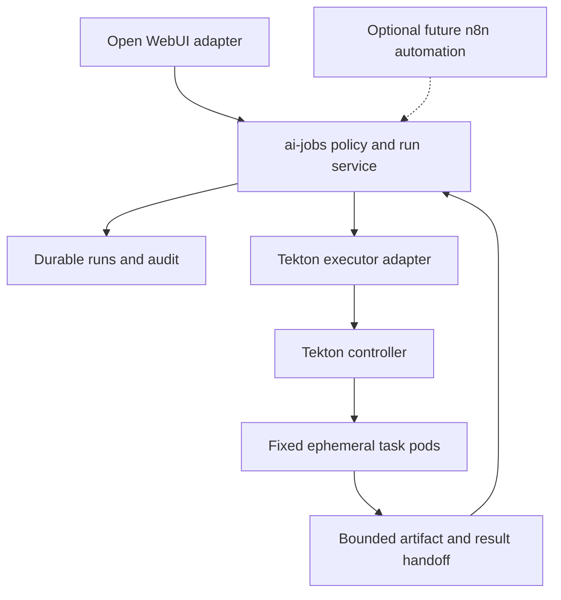

# AI jobs architecture and workflow-engine decision

**Status:** proposed, planning only. No executor or workflow engine is deployed by this change.
**Date:** 2026-09-17
**Implementation:** [phased plan](../plans/2026-09-17-ai-jobs-workflows.md)

## Recommendation

Use **Tekton Pipelines as the planned execution backend**, behind the existing
`ai-jobs` boundary. Implement the Git change profile first to validate the integration.
Recovery engineering and latency trials are deferred; neither is an adoption gate.
There is no fixed pod time budget or performance target at this stage. Existing
code-level timeout constants are implementation defaults to revisit, not product
requirements. Keep `ai-jobs` small: HearthAI
policy and product semantics belong here; task dependency scheduling belongs in
Tekton. Do not build a general workflow language, scheduler, or DAG interpreter.

Keep **n8n optional, above `ai-jobs`**, for a concrete recurring automation that
benefits from its triggers, integrations, and waits. It is not the tool sandbox or
an alternative authorization service. Do not deploy both engines for the first release.

Plain Kubernetes Jobs remain an alternative if implementation exposes a concrete
compatibility or operational problem with Tekton. In that case implement only
the fixed stage sequences required by the shipped profiles. Do not maintain two
production backends until measurements establish a need for both.

These are recommendations for review, not previously approved technology choices.
This design supersedes the single-Job executor assumption in the September 7 plan;
Git remains the first substrate validation profile, followed by webfetch, then research.

## What exists today

Reviewed against main commit `87623b22b7ab82de527365276c293b85f11d44c1`.

| Existing code | What is present | Missing runtime behavior |
| --- | --- | --- |
| `service/ai_jobs/src/ai_jobs/contracts.py` | Run states and typed contracts | Production transport and authenticated caller identity |
| `registry.py`, `tools/git_change.py`, `tools/web_fetch.py` | Closed registry and versioned capability definitions | Repository authorization and credential broker; Git result validation |
| `runs.py` | Validation, request digest, idempotent admission | Authenticated dispatch and authorization; restart recovery is deferred |
| `storage.py` | `RunStore` protocol and in-memory implementation | Durable run, attempt, audit, and publication records |
| `executor.py` | `start(run_id, profile)` and `cancel(run_id)` protocol | Kubernetes implementation, observation, cleanup, request delivery |
| `service/web_fetch/` | Rust fetch and inspection binaries, envelopes, sealed handoff | Separate pods, handoff transport, packaged runtime integration |
| `deploy/charts/hearthai/` | Cohesive application chart | `ai-jobs` runtime and profiles |

The executor currently receives no validated request. Webfetch's stored request
intentionally contains a URL digest, not the URL. An executor cannot reconstruct
that input from the run record. The implementation must solve dispatch and input
lifetime together, rather than adding a Tekton client to `start()` and assuming
request delivery already works. Git's result validator is explicitly unimplemented.

## Comparing the choices

This table is an architectural judgment for HearthAI, not a general product ranking.

| Concern | Fixed Kubernetes Jobs | Tekton Pipelines | n8n |
| --- | --- | --- | --- |
| Ephemeral Kubernetes execution | Direct match; HearthAI coordinates stages | TaskRuns create pods; good match for reviewed profiles | Workflow workers are not HearthAI's per-run pod boundary |
| Dependencies, bounded retries, timeouts | Code to write and maintain | Native pipeline facilities | Workflow facilities, but pod lifecycle still needs an executor |
| Git worker then isolated publisher | Explicit sequence in code | Separate Tasks, never two Steps of one Task | Call `ai-jobs`; do not implement publishing in n8n |
| Fetch then offline inspection | Explicit sequence plus handoff | Separate Tasks plus handoff | Call `web_fetch` through `ai-jobs` |
| Human waits, schedules, service integrations | Outside initial executor | Keep long waits outside pod execution | Natural candidate for a later automation layer |
| Dynamic agent reasoning | Fixed worker runs bounded loop | Fixed worker runs bounded loop | Do not migrate HearthAI's agent loop just to gain workflows |
| Additional operations | Kubernetes plus HearthAI persistence | CRDs, controller, upgrades and pruning | Application/database; Redis and workers if using queue mode |
| Custom code still needed | Policy, artifacts, lifecycle and stage sequencing | Policy, artifacts, lifecycle mapping and engine adapter | Same `ai-jobs` substrate, plus automation integration |

Tekton supports dependencies, retries, conditions and final tasks. Task steps run
within a pod: a Step boundary is not a network or credential isolation boundary.
Use separate Tasks for separate trust domains. [Tekton Pipelines](https://tekton.dev/docs/pipelines/pipelines/),
[TaskRuns](https://tekton.dev/docs/pipelines/taskruns/).

n8n queue mode uses Redis and database-backed workers, rather than creating a
fresh Kubernetes pod for each HearthAI capability. Its external task runners
execute Code-node JavaScript/Python; they do not by themselves provide HearthAI's
fixed Git and Rust webfetch profiles. These are reasons to put n8n upstream of
`ai-jobs`, not claims that n8n cannot orchestrate external services.
[n8n queue mode](https://docs.n8n.io/deploy/host-n8n/configure-n8n/scaling/enable-queue-mode),
[n8n task runners](https://docs.n8n.io/deploy/host-n8n/configure-n8n/set-up-task-runners).

A useful future n8n flow could schedule a repository maintenance request, call an
authorized HearthAI capability, wait for completion, and notify the user. Its Wait
node can resume on time, a webhook, or a form submission. HearthAI still validates
any approval and destination. [n8n Wait](https://docs.n8n.io/integrations/builtin/core-nodes/n8n-nodes-base.wait).

## Ownership and topology

| Owner | Responsibilities |
| --- | --- |
| Open WebUI / HearthAI session integration | Authenticate the person, carry conversation context, present results and approvals |
| `ai-jobs` | Capability admission, repository authorization, budgets, profile resolution, idempotency, durable run state, credential issuance, result validation and audit |
| Tekton | Execute the admitted fixed task graph, dependency ordering, configured execution retries/timeouts and pod lifecycle |
| Kubernetes / cluster policy | Scheduling, runtime isolation, RBAC, network policy, resource quotas and storage enforcement |
| Workers | One bounded profile operation; no infrastructure choices or authority expansion |
| Optional n8n | Invoke authorized capabilities for a trusted automation identity; manage automation-level triggers and waits |

`ai-jobs` stays the **single HearthAI execution control plane**. Tekton is an
implementation dependency, not a second model-facing job API. The database owns
HearthAI business state and audit; Kubernetes owns observed execution state.
The adapter observes execution and records results. Restart reconciliation is
follow-on work; it does not reschedule Tekton's individual Tasks.

All model-callable tools, including future memory or knowledge tools, must use
this admission boundary when enabled. An Open WebUI built-in or n8n Code node must
not become a backdoor for model-requested execution. Administrative UI actions
and trusted infrastructure controllers are not model-callable tools.

## Small, explicit implementation boundaries

Extend the existing code using composition and domain objects with enforced
invariants. Retain Python for the initial control-plane implementation; using
Tekton is not a reason to rewrite it. Rust webfetch stays language-neutral.
Go remains an option if concrete controller needs justify it later.

- `RunService` handles typed admission and authorization, without Kubernetes details.
- `Run` encapsulates legal transitions and terminal-state rules.
- `RunRepository` implements persistence, idempotency and audit.
- `ProfileCatalog` resolves a reviewed version to fixed tasks, images, limits and policy.
- `TektonExecutor` submits, observes and cancels that profile; it does not decide authority.
- `ArtifactStore` owns bounded transfer, finalization, retention and cleanup.
- `RepositoryProvider` resolves authorized repositories and provides materialization and
  publication operations. GitHub is the first adapter; repository IDs stay provider-neutral.

These are responsibility boundaries, not a requirement for a class per bullet or
an extensible plugin framework. Prefer straightforward methods and focused tests.
Do not put profile-name conditionals throughout transport, storage and execution.

The proposed internal executor contract is `ensure_started(execution_spec)`,
`observe(execution_ref)` and `request_cancel(execution_ref)`. An execution spec is
created by trusted code from a frozen profile version and run identity; the public
request never contains it. `ensure_started` is idempotent. Its contents reference
short-lived input, never inline credentials or an arbitrary Kubernetes manifest.

## Admission, dispatch and lifecycle

1. Authenticate and authorize the tool and opaque repository ID. Resolve the
   provider, base commit, grants and any required approval.
2. Persist the run and admission audit. Retain caller/tool/version/idempotency-key
   uniqueness and payload-digest conflict behavior.
3. Submit the fixed Tekton profile with a run-derived name and record its identity.
   Duplicate client requests return the existing run; they do not create new work.
4. Observe task completion, validate the result envelope or Git receipt, and record
   the terminal state before cleaning up the run's resources.

Keep the existing states: `accepted`, `starting`, `running`, `succeeded`, `failed`,
`timed_out`, `cancelled`. Validate transitions and prevent late results from
replacing terminal outcomes. Basic explicit cancellation stops remaining work;
no restart-recovery framework or fault-injection trial is required initially.

Do not automatically replay an externally mutating stage after an ambiguous failure.
Record uncertainty and leave inspection/manual resolution to the operator for now.
Transactional outboxes, restart reconciliation, automatic publication recovery and
leader failover are deferred until there is a concrete need.

### Timing and input lifetime

There is no prescribed short or long pod runtime budget. Operational timeouts may
be configurable to stop abandoned work, but they are not performance targets and
must not determine engine choice. The existing webfetch 25-second constant is not
a requirement for this architecture; update that default/configuration when wiring
the executor. HTTP connection timeouts and pod execution duration are separate
concerns. Adapt the chat integration to the work instead of forcing every pipeline
into a short synchronous HTTP request.

Durable audit keeps tool-approved storage views. Full webfetch URLs, raw responses,
provider credentials and prompts must not become Tekton params, labels, Results,
exception strings or general logs. Params carry opaque run/input/artifact IDs only.
Deliver validated input explicitly through bounded temporary storage. A URL digest
cannot reconstruct a request. Lost input or an interrupted run may require manual
cleanup and a fresh invocation initially; seamless restart recovery is not promised.
Do not persist sensitive inputs merely to implement deferred replay behavior.

## Profiles and artifact boundaries

Profiles are versioned, reviewed application assets. Pin images by digest and freeze
the task specification per attempt. Callers cannot select Tasks, resolvers, images,
commands, mounts, environments, service accounts or network settings. Pass request
data as bounded files, not shell interpolation. Worker pods have no Kubernetes
API token, host mounts or ambient credentials. The trusted controller necessarily
has narrowly scoped Kubernetes API permissions; this does not grant them to workers.

### Git change

The typed request remains `{repository_id, instruction}`. HearthAI authorization
is required for every provider; a selected GitHub App installation is an additional
GitHub-specific condition, not a requirement for every Git server.

A worker Task uses a materializer init container with short-lived read-only access,
then removes credential residue before running repository code in an ephemeral
workspace. Preserve the existing out-of-band credential rules when retaining history.
The worker has no provider token. A separate publisher Task starts only after the
worker pod has terminated and the artifact has been finalized. It refetches the
pinned repository base and applies changes without executing repository code, Git
hooks, filters or submodule commands from that repository.

The publisher gets a short-lived repository-scoped write token only after authority,
approval and cancellation checks, plus any configured operational timeout. It uses a run-derived branch. If a push or PR creation has an ambiguous outcome,
record it and require operator inspection before retrying; automatic publication
recovery is deferred.
Record base/head commits, artifact digest, checks and provider actor. Never merge
or push directly to the protected base branch. A changed base requires an explicit
conflict/rebase policy; do not silently republish different content under an old approval.

### Webfetch

Fetch and inspection are separate Tasks/pods. Fetch has the existing bounded public
HTTP egress policy; inspection has **no egress**, including no artifact-service access.
The existing sealed handoff and separate per-run key mount remain intact until a
separate change deliberately replaces them. Input transfer must finish before the
inspector starts. Output leaves only after inspection completes via trusted collection.

A fetch exit code of `1` represents a recorded public failure which inspection must
still turn into an envelope. A fixed wrapper distinguishes that from exit `2`
(infrastructure failure); a naive success-only DAG edge would lose error envelopes.
Inspection exit `1` likewise has a valid non-success envelope to collect. Neither
case becomes a successful tool result merely because the wrapper completed.

Do not put whole responses into Tekton Results or pod termination messages. Those
are coordination metadata, not the content transport. Raw content stays in bounded
handoff storage and only accepted envelopes reach the model.

### Handoff proposal and explicit policy trade-off

An `emptyDir` cannot be shared across Tasks/pods. Tekton Workspaces do not change
that. [Tekton Workspaces](https://tekton.dev/docs/pipelines/workspaces/).

**Proposed transport:** isolated, per-run staging PVCs for bounded artifacts,
with fresh pod-local `emptyDir` workspaces for repository execution. Trusted transfer
Tasks finalize artifacts, copy them to separate consumer claims, and terminate
before consumers start. A publisher never mounts a claim that the Git worker could
write. For webfetch, mount the finalized input read-only in the offline inspector;
use a separate output claim and a later trusted collector Task to submit its envelope.
The collector does not execute artifact contents. Bind manifests to run, attempt,
stage, digest and size; reject cross-run references, path traversal, symlinks and
oversized files. Artifacts are worker-controlled data, not approval or authority.

This is an **explicit proposed exception** to the existing no-durable-volume rule:
run-scoped handoff storage can outlive a pod for transfer, but is never a
reusable worker workspace. Record this limited exception when implementing the handoff.
No shared household NFS workspace or cross-run claim is allowed. An untrusted
worker may write only its outgoing artifact area, not its consumer's copy. Finalize
only after all producer containers terminate. Storage cleanup requires deleting
both claims and underlying volumes according to the tested reclaim policy; PVC
deletion alone is not proof of data erasure.

The current inspector tries to delete the raw body. For read-only input, add an
explicit executor-managed cleanup mode and put responsibility in executor-managed
cleanup; do not ignore a failed delete and claim raw data is gone. Preserve the
HMAC key outside all artifact volumes. Limit output/log retention independently.

The extra transfer/collection Tasks are part of the reviewed fixed profile, with
bounded resources and no model-facing operations. This expands the physical pod
count beyond the original two webfetch workers. There is no latency trial or
25-second adoption gate. Keep fetch and inspection separate and inspection offline;
choose timeout configuration to suit the workflow when implementing it.

## Deployment and operations

HearthAI packages `ai-jobs`, migrations, profile Tasks/Pipelines, namespaced RBAC,
network policies, quotas, cleanup, images and the Open WebUI adapter. home-ops owns
the cluster-scoped Tekton installation/CRDs and supplies its supported version,
storage class, domains, credentials and existing external Postgres connection.
Use the bundled default-on simple Postgres when external Postgres is not supplied;
use a dedicated database/role for runs. Do not add CNPG to HearthAI or Redis just
for this backend. Install CRDs/controller before application profiles.

Deploy only Tekton Pipelines initially. Triggers, Dashboard, Chains and Results
are not required by this design. Authenticate run/status/cancellation operations;
never expose the Kubernetes API to Open WebUI or n8n. Cluster RBAC scopes the
controller; fixed-spec validation remains necessary because permission to create
a TaskRun can indirectly create a powerful pod.

Use a single control-plane instance initially, with database-enforced
idempotency and transactions. Readiness checks cover persistence, backend API,
profile availability and required policy/storage configuration. A missing backend
makes capabilities unavailable; it must not fall back to local execution.

Implement normal completion/cancellation cleanup for temporary inputs, run Secrets,
PVCs and owned Tekton resources. Keep audit/results before pruning engine objects.
Document manual cleanup for interrupted runs initially; an automatic orphan janitor
and restart reconciliation are follow-on work. Basic status and failure diagnostics
are sufficient; performance dashboards and latency targets are deferred.

## Implementation scope and follow-on work

Proceed with Tekton and validate the fixed Git profile, artifact boundaries and
result handling through ordinary integration tests. Confirm images support the
actual target nodes or select a compatible node pool. No recovery trial, benchmark
campaign or performance threshold blocks implementation.

Defer automatic restart recovery, dispatch outboxes, publication reconciliation,
failover and latency tuning. Interrupted or ambiguous work can require operator
inspection and a fresh invocation. Revisit those capabilities when practical use
shows they are worth the complexity.

n8n remains a follow-on when there is a named automation to ship. Its identity
must be scoped to authorized capabilities and destinations. Repeated workflow
execution must reuse a stable invocation key for the same action; an intentional
new occurrence gets a new key. An n8n wait/form is not proof of HearthAI approval.
Do not keep a sandbox pod alive while waiting for a person. Define durable
asynchronous session delivery and approval semantics before enabling such flows;
this plan does not silently change synchronous webfetch into a public job API.
